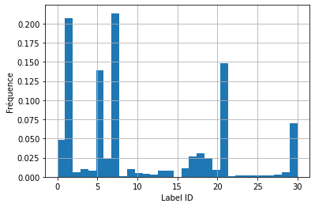
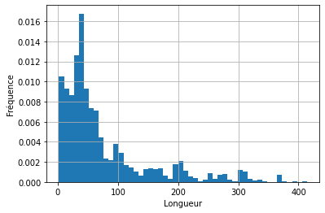
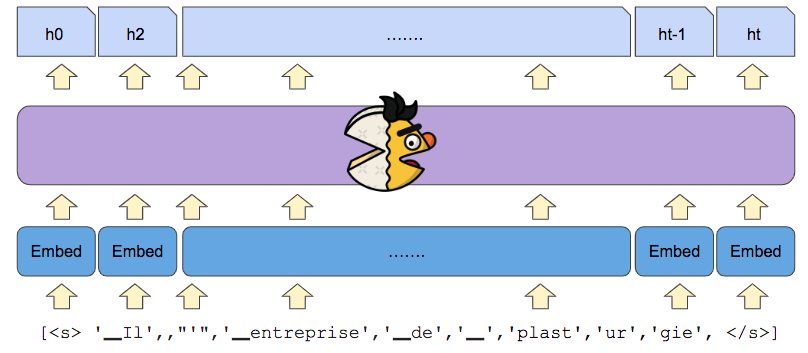

Ce tutoriel a été conçu dans le cadre des journées [Deep Voice de l'IRCAM](https://www.ircam.fr/agenda/deep-voice-paris/detail) par Roman Castagné, Nathan Godey et Benjamin Muller.


Une version du tutoriel en anglais en version pdf slide est disponible [ici](/pdf/hands-on-camembert-tutorial-slides-en.pdf), ainsi que le même tutoriel dans [Google Colab](https://colab.research.google.com/drive/1W0Fj7aXm2qPx34PbEo0F5s5_sm8vVrJl?usp=sharing).

Cet atelier présente le modèle de langue CamemBERT et différents cas d'usage. Nous allons nous intéresser particulièrement au cas de la **classification d'acte de dialogue**.

&nbsp;

# Dans ce Tutoriel:

Ce tutoriel est une introduction au Natural Language Processing et en particulier au modèle de langue de type BERT. 

## Objectifs 
- Comprendre le fonctionnement du modèle CamemBERT. 
- Apprendre à construire un modèle pour une tâche spécifique de NLP avec CamemBERT. 

## Pour cela

Nous allons nous intéresser à une tâche de classification de séquence: **la tâche de prédiction d'acte de dialogue**. 

Nous allons utiliser le dataset MIAM (introduis [ici](https://aclanthology.org/2021.emnlp-main.656.pdf)) afin d'entraîner et d'évaluer nos modèles sur cette tâche. 

Nous travaillerons avec la librairie `transformers` de Hugging-Face 🤗 ainsi que la librairie `pytorch-lightning`.

Cette mise en pratique se fera en deux parties:
- **(Partie 1)** **Comprendre** la modélisation du français par Camembert
- **(Partie 2)** **Fine-tuning** : comment ré-entraîner CamemBERT sur nos données pour répondre à notre tâche de classification d'acte de dialogue? Pour passer directement à la deuxième partie c'est par [ici]()


## Prérequis

- bases en python 
- bases en machine learning


La première étape est l'installation et l'importation des librairies utilisées dans la suite de l'atelier. Certaines librairies (torch, numpy, sklearn, ...) sont pré-installées dans l'environnement de Google Colab, nous n'avons donc pas besoin de nous en occuper.

```python
!pip install transformers plotly==5.8.0 pyyaml==5.4.1 datasets pytorch-lightning > /dev/null 2>&1
```

```python
from pprint import pprint
import functools

import torch
from torch.utils.data import DataLoader
import torch.nn.functional as F
import pytorch_lightning as pl
from transformers import AutoModelForSequenceClassification, CamembertForMaskedLM, AutoTokenizer, AutoConfig
from datasets import load_dataset
from sklearn.metrics import confusion_matrix, f1_score

import matplotlib.pyplot as plt
import seaborn as sns
import plotly.express as px
from tqdm.notebook import tqdm
```

&nbsp;

# Partie 1: Comprendre la modélisation du français par **CamemBERT**

Rentrons dans le vif du sujet et téléchargeons le modèle CamemBERT grâce à la librairie HuggingFace, il suffit d'une ligne:


```python
camembert = CamembertForMaskedLM.from_pretrained('camembert-base')
```


> [HuggingFace](https://huggingface.co/) est une bibliothèque en ligne gratuite de modèles pré-entraînés et de jeux de données (*datasets*) qui permet d'utiliser les architectures et les poids des modèles mis à disposition par les équipes de recherche / institutions. Nous vous invitons à faire un tour sur leur plateforme, sur laquelle il est possible de rechercher:


## L'architecture de Camembert: le Transformer

Le Transformer est une architecture *deep learning* introduite en 2017 dans l'article [Attention Is All You Need](https://arxiv.org/pdf/1706.03762.pdf). Il permet de traiter des séquences dont les éléments sont fortement inter-dépendants, comme c'est le cas pour les mots d'une phrase par exemple.

CamemBERT-base (la version base du modèle) est composé: 
- d'une **couche d'embedding** pour représenter chaque mot en vecteur
-  de 12 couches cachées composées principalement de deux types de transformations: des transformations dites **self-attention** et des transformations **denses**


Schématiquement: 

<!-- <p align="center">
  
</p> -->


```python
# Visualiser la couches d'embeddings
camembert.roberta.embeddings
```


    RobertaEmbeddings(
      (word_embeddings): Embedding(32005, 768, padding_idx=1)
      (position_embeddings): Embedding(514, 768, padding_idx=1)
      (token_type_embeddings): Embedding(1, 768)
      (LayerNorm): LayerNorm((768,), eps=1e-05, elementwise_affine=True)
      (dropout): Dropout(p=0.1, inplace=False)
    )


Dans le résultat de la cellule ci-dessus, on peut voir que la couche d'embedding (*RobertaEmbeddings*) stocke 32005 vecteurs de dimension 768 (*word_embeddings*). Chacun de ces vecteurs est associé à un mot du vocabulaire du modèle.

Les *position embeddings* renseignent quant à eux sur la position d'un mot dans la séquence d'entrée.


```python
# Visualiser les couches cachées
print(f"Camembert est composé de {len(camembert.roberta.encoder.layer)} couches cachées\n")
print("Composition de la première couche :")
camembert.roberta.encoder.layer[0]
```

    Camembert est composé de 12 couches cachées
    
    Composition de la première couche :

    RobertaLayer(
      (attention): RobertaAttention(
        (self): RobertaSelfAttention(
          (query): Linear(in_features=768, out_features=768, bias=True)
          (key): Linear(in_features=768, out_features=768, bias=True)
          (value): Linear(in_features=768, out_features=768, bias=True)
          (dropout): Dropout(p=0.1, inplace=False)
        )
        (output): RobertaSelfOutput(
          (dense): Linear(in_features=768, out_features=768, bias=True)
          (LayerNorm): LayerNorm((768,), eps=1e-05, elementwise_affine=True)
          (dropout): Dropout(p=0.1, inplace=False)
        )
      )
      (intermediate): RobertaIntermediate(
        (dense): Linear(in_features=768, out_features=3072, bias=True)
        (intermediate_act_fn): GELUActivation()
      )
      (output): RobertaOutput(
        (dense): Linear(in_features=3072, out_features=768, bias=True)
        (LayerNorm): LayerNorm((768,), eps=1e-05, elementwise_affine=True)
        (dropout): Dropout(p=0.1, inplace=False)
      )
    )


Dans la plupart des couches du modèle, les vecteurs utilisés sont de dimension 768. C'est ce qu'on appelle la *dimension cachée* du modèle.

Nous pouvons aussi calculer le poids total du modèle en MB:


```python
def display_nb_params(model):
    param_size = 0
    param_count = 0
    for param in model.parameters():
        param_count += param.nelement()
        param_size += param.nelement() * param.element_size()
    buffer_size = 0
    for buffer in model.buffers():
        buffer_size += buffer.nelement() * buffer.element_size()

    size_all_mb = (param_size + buffer_size) / 1024**2
    print('Nombre de paramètres: {} | Poids du modèle: {:.2f}MB'.format(param_count, size_all_mb))

display_nb_params(camembert)
```

    Nombre de paramètres: 110655493 | Poids du modèle: 422.13MB

&nbsp;

## Faire des Prédictions avec CamemBERT en mode modèle de langue


Avant d'utiliser le modèle CamemBERT pour la classification de phrases, nous allons étudier les différentes étapes qui permettent de passer d'une phrase (sous la forme d'une chaîne de caractères) à une prédiction.

Le modèle que nous avons téléchargé est pré-entraîné avec une tâche de *Masked Language Modelling* : certains mots ou sous-mots de la séquence sont masqués et on demande au modèle de les prédire à partir du contexte (les mots non-masqués).


Considérons un exemple simple dans lequel nous voulons compléter 3 phrases dans lesquelles nous avons masqué un mot:


```python
batch_sentences = [
    "Vous savez où est la <mask> la plus proche?",
    "La Seine est un <mask>.",
    "Je cherche urgemment un endroit où retirer de l'<mask>.",
]
```

La première étape consiste à **tokeniser** les chaînes de caractères. Il s'agit de découper les phrases d'entrée en mots et sous-mots (appelés ***tokens***) issus d'un vocabulaire extrait à l'aide de l'algorithme *Sentencepiece*  [(article de blog pour plus de détails)](https://towardsdatascience.com/byte-pair-encoding-subword-based-tokenization-algorithm-77828a70bee0).

Chaque token est ensuite identifié à l'aide d'un entier correspondant à sa position dans le vocabulaire (`input_ids`) et un masque indique sur quels tokens l'attention doit se porter dans chaque phrase (`attention_mask`):


```python
tokenizer = AutoTokenizer.from_pretrained('camembert-base')

tokenizer_output = tokenizer(
    batch_sentences
)
pprint(tokenizer_output, width=150)
```


    {'attention_mask': [[1, 1, 1, 1, 1, 1, 1, 1, 1, 1, 1, 1], [1, 1, 1, 1, 1, 1, 1, 1, 1], [1, 1, 1, 1, 1, 1, 1, 1, 1, 1, 1, 1, 1, 1, 1, 1, 1]],
     'input_ids': [[5, 158, 2591, 147, 30, 13, 32004, 13, 40, 1084, 197, 6],
                   [5, 61, 4458, 30, 23, 32004, 21, 9, 6],
                   [5, 100, 1066, 21, 20090, 10256, 23, 1643, 147, 4384, 8, 17, 11, 32004, 21, 9, 6]]}


On note que le `tokenizer` associé à CamemBERT peut lui aussi être téléchargé depuis HuggingFace.

Nous pouvons décoder les `input_ids` afin d'observer le comportement du tokenizer, notamment la manière dont il segmente le mot *urgemment* en deux tokens: *urge* et *mment*:


```python
pprint([tokenizer.convert_ids_to_tokens(input_ids) for input_ids in tokenizer_output['input_ids']], width=150)
```

    [['<s>', '▁Vous', '▁savez', '▁où', '▁est', '▁la', '<mask>', '▁la', '▁plus', '▁proche', '?', '</s>'],
     ['<s>', '▁La', '▁Seine', '▁est', '▁un', '<mask>', '▁', '.', '</s>'],
     ['<s>', '▁Je', '▁cherche', '▁', 'urge', 'mment', '▁un', '▁endroit', '▁où', '▁retirer', '▁de', '▁l', "'", '<mask>', '▁', '.', '</s>']]


On remarque aussi que les espaces ont été remplacés par des caractères spéciaux (▁). Deux tokens ont été ajoutés: un token de début de séquence `<s>`, et un token de fin de séquence `</s>`.

Cette tokenisation n'est pas adaptée dans notre cas: les couches Transformers du modèle CamemBERT **traitent des séquences de longueur fixe** (ici 512). Il faut donc ajouter des tokens de *padding*, qui complètent les séquences:


```python
tokenizer_output = tokenizer(
    batch_sentences,
    padding="max_length"
)
pprint(tokenizer_output, compact=True, width=150)
```

    {'attention_mask': [[1, 1, 1, 1, 1, 1, 1, 1, 1, 1, 1, 1, 0, 0, 0, 0, 0, 0, 0, 0, 0, 0, 0, 0, 0, 0, 0, 0, 0, 0, 0, 0, 0, 0, 0, 0, 0, 0, 0, 0, 0, 0, 0,
                         0, 0, 0, 0, 0, 0, 0, 0, 0, 0, 0, 0, 0, 0, 0, 0, 0, 0, 0, 0, 0, 0, 0, 0, 0, 0, 0, 0, 0, 0, 0, 0, 0, 0, 0, 0, 0, 0, 0, 0, 0, 0, 0,
                         0, 0, 0, 0, 0, 0, 0, 0, 0, 0, 0, 0, 0, 0, 0, 0, 0, 0, 0, 0, 0, 0, 0, 0, 0, 0, 0, 0, 0, 0, 0, 0, 0, 0, 0, 0, 0, 0, 0, 0, 0, 0, 0,
                         0, 0, 0, 0, 0, 0, 0, 0, 0, 0, 0, 0, 0, 0, 0, 0, 0, 0, 0, 0, 0, 0, 0, 0, 0, 0, 0, 0, 0, 0, 0, 0, 0, 0, 0, 0, 0, 0, 0, 0, 0, 0, 0,
                         0, 0, 0, 0, 0, 0, 0, 0, 0, 0, 0, 0, 0, 0, 0, 0, 0, 0, 0, 0, 0, 0, 0, 0, 0, 0, 0, 0, 0, 0, 0, 0, 0, 0, 0, 0, 0, 0, 0, 0, 0, 0, 0,
                         0, 0, 0, 0, 0, 0, 0, 0, 0, 0, 0, 0, 0, 0, 0, 0, 0, 0, 0, 0, 0, 0, 0, 0, 0, 0, 0, 0, 0, 0, 0, 0, 0, 0, 0, 0, 0, 0, 0, 0, 0, 0, 0,
                         0, 0, 0, 0, 0, 0, 0, 0, 0, 0, 0, 0, 0, 0, 0, 0, 0, 0, 0, 0, 0, 0, 0, 0, 0, 0, 0, 0, 0, 0, 0, 0, 0, 0, 0, 0, 0, 0, 0, 0, 0, 0, 0,
                         0, 0, 0, 0, 0, 0, 0, 0, 0, 0, 0, 0, 0, 0, 0, 0, 0, 0, 0, 0, 0, 0, 0, 0, 0, 0, 0, 0, 0, 0, 0, 0, 0, 0, 0, 0, 0, 0, 0, 0, 0, 0, 0,
                         0, 0, 0, 0, 0, 0, 0, 0, 0, 0, 0, 0, 0, 0, 0, 0, 0, 0, 0, 0, 0, 0, 0, 0, 0, 0, 0, 0, 0, 0, 0, 0, 0, 0, 0, 0, 0, 0, 0, 0, 0, 0, 0,
                         0, 0, 0, 0, 0, 0, 0, 0, 0, 0, 0, 0, 0, 0, 0, 0, 0, 0, 0, 0, 0, 0, 0, 0, 0, 0, 0, 0, 0, 0, 0, 0, 0, 0, 0, 0, 0, 0, 0, 0, 0, 0, 0,
                         0, 0, 0, 0, 0, 0, 0, 0, 0, 0, 0, 0, 0, 0, 0, 0, 0, 0, 0, 0, 0, 0, 0, 0, 0, 0, 0, 0, 0, 0, 0, 0, 0, 0, 0, 0, 0, 0, 0, 0, 0, 0, 0,
                         0, 0, 0, 0, 0, 0, 0, 0, 0, 0, 0, 0, 0, 0, 0, 0, 0, 0, 0, 0, 0, 0, 0, 0, 0, 0, 0, 0, 0, 0, 0, 0, 0, 0, 0, 0, 0, 0, 0],
                        [1, 1, 1, 1, 1, 1, 1, 1, 1, 0, 0, 0, 0, 0, 0, 0, 0, 0, 0, 0, 0, 0, 0, 0, 0, 0, 0, 0, 0, 0, 0, 0, 0, 0, 0, 0, 0, 0, 0, 0, 0, 0, 0,
                         0, 0, 0, 0, 0, 0, 0, 0, 0, 0, 0, 0, 0, 0, 0, 0, 0, 0, 0, 0, 0, 0, 0, 0, 0, 0, 0, 0, 0, 0, 0, 0, 0, 0, 0, 0, 0, 0, 0, 0, 0, 0, 0,
                         0, 0, 0, 0, 0, 0, 0, 0, 0, 0, 0, 0, 0, 0, 0, 0, 0, 0, 0, 0, 0, 0, 0, 0, 0, 0, 0, 0, 0, 0, 0, 0, 0, 0, 0, 0, 0, 0, 0, 0, 0, 0, 0,
                         0, 0, 0, 0, 0, 0, 0, 0, 0, 0, 0, 0, 0, 0, 0, 0, 0, 0, 0, 0, 0, 0, 0, 0, 0, 0, 0, 0, 0, 0, 0, 0, 0, 0, 0, 0, 0, 0, 0, 0, 0, 0, 0,
                         0, 0, 0, 0, 0, 0, 0, 0, 0, 0, 0, 0, 0, 0, 0, 0, 0, 0, 0, 0, 0, 0, 0, 0, 0, 0, 0, 0, 0, 0, 0, 0, 0, 0, 0, 0, 0, 0, 0, 0, 0, 0, 0,
                         0, 0, 0, 0, 0, 0, 0, 0, 0, 0, 0, 0, 0, 0, 0, 0, 0, 0, 0, 0, 0, 0, 0, 0, 0, 0, 0, 0, 0, 0, 0, 0, 0, 0, 0, 0, 0, 0, 0, 0, 0, 0, 0,
                         0, 0, 0, 0, 0, 0, 0, 0, 0, 0, 0, 0, 0, 0, 0, 0, 0, 0, 0, 0, 0, 0, 0, 0, 0, 0, 0, 0, 0, 0, 0, 0, 0, 0, 0, 0, 0, 0, 0, 0, 0, 0, 0,
                         0, 0, 0, 0, 0, 0, 0, 0, 0, 0, 0, 0, 0, 0, 0, 0, 0, 0, 0, 0, 0, 0, 0, 0, 0, 0, 0, 0, 0, 0, 0, 0, 0, 0, 0, 0, 0, 0, 0, 0, 0, 0, 0,
                         0, 0, 0, 0, 0, 0, 0, 0, 0, 0, 0, 0, 0, 0, 0, 0, 0, 0, 0, 0, 0, 0, 0, 0, 0, 0, 0, 0, 0, 0, 0, 0, 0, 0, 0, 0, 0, 0, 0, 0, 0, 0, 0,
                         0, 0, 0, 0, 0, 0, 0, 0, 0, 0, 0, 0, 0, 0, 0, 0, 0, 0, 0, 0, 0, 0, 0, 0, 0, 0, 0, 0, 0, 0, 0, 0, 0, 0, 0, 0, 0, 0, 0, 0, 0, 0, 0,
                         0, 0, 0, 0, 0, 0, 0, 0, 0, 0, 0, 0, 0, 0, 0, 0, 0, 0, 0, 0, 0, 0, 0, 0, 0, 0, 0, 0, 0, 0, 0, 0, 0, 0, 0, 0, 0, 0, 0, 0, 0, 0, 0,
                         0, 0, 0, 0, 0, 0, 0, 0, 0, 0, 0, 0, 0, 0, 0, 0, 0, 0, 0, 0, 0, 0, 0, 0, 0, 0, 0, 0, 0, 0, 0, 0, 0, 0, 0, 0, 0, 0, 0],
                        [1, 1, 1, 1, 1, 1, 1, 1, 1, 1, 1, 1, 1, 1, 1, 1, 1, 0, 0, 0, 0, 0, 0, 0, 0, 0, 0, 0, 0, 0, 0, 0, 0, 0, 0, 0, 0, 0, 0, 0, 0, 0, 0,
                         0, 0, 0, 0, 0, 0, 0, 0, 0, 0, 0, 0, 0, 0, 0, 0, 0, 0, 0, 0, 0, 0, 0, 0, 0, 0, 0, 0, 0, 0, 0, 0, 0, 0, 0, 0, 0, 0, 0, 0, 0, 0, 0,
                         0, 0, 0, 0, 0, 0, 0, 0, 0, 0, 0, 0, 0, 0, 0, 0, 0, 0, 0, 0, 0, 0, 0, 0, 0, 0, 0, 0, 0, 0, 0, 0, 0, 0, 0, 0, 0, 0, 0, 0, 0, 0, 0,
                         0, 0, 0, 0, 0, 0, 0, 0, 0, 0, 0, 0, 0, 0, 0, 0, 0, 0, 0, 0, 0, 0, 0, 0, 0, 0, 0, 0, 0, 0, 0, 0, 0, 0, 0, 0, 0, 0, 0, 0, 0, 0, 0,
                         0, 0, 0, 0, 0, 0, 0, 0, 0, 0, 0, 0, 0, 0, 0, 0, 0, 0, 0, 0, 0, 0, 0, 0, 0, 0, 0, 0, 0, 0, 0, 0, 0, 0, 0, 0, 0, 0, 0, 0, 0, 0, 0,
                         0, 0, 0, 0, 0, 0, 0, 0, 0, 0, 0, 0, 0, 0, 0, 0, 0, 0, 0, 0, 0, 0, 0, 0, 0, 0, 0, 0, 0, 0, 0, 0, 0, 0, 0, 0, 0, 0, 0, 0, 0, 0, 0,
                         0, 0, 0, 0, 0, 0, 0, 0, 0, 0, 0, 0, 0, 0, 0, 0, 0, 0, 0, 0, 0, 0, 0, 0, 0, 0, 0, 0, 0, 0, 0, 0, 0, 0, 0, 0, 0, 0, 0, 0, 0, 0, 0,
                         0, 0, 0, 0, 0, 0, 0, 0, 0, 0, 0, 0, 0, 0, 0, 0, 0, 0, 0, 0, 0, 0, 0, 0, 0, 0, 0, 0, 0, 0, 0, 0, 0, 0, 0, 0, 0, 0, 0, 0, 0, 0, 0,
                         0, 0, 0, 0, 0, 0, 0, 0, 0, 0, 0, 0, 0, 0, 0, 0, 0, 0, 0, 0, 0, 0, 0, 0, 0, 0, 0, 0, 0, 0, 0, 0, 0, 0, 0, 0, 0, 0, 0, 0, 0, 0, 0,
                         0, 0, 0, 0, 0, 0, 0, 0, 0, 0, 0, 0, 0, 0, 0, 0, 0, 0, 0, 0, 0, 0, 0, 0, 0, 0, 0, 0, 0, 0, 0, 0, 0, 0, 0, 0, 0, 0, 0, 0, 0, 0, 0,
                         0, 0, 0, 0, 0, 0, 0, 0, 0, 0, 0, 0, 0, 0, 0, 0, 0, 0, 0, 0, 0, 0, 0, 0, 0, 0, 0, 0, 0, 0, 0, 0, 0, 0, 0, 0, 0, 0, 0, 0, 0, 0, 0,
                         0, 0, 0, 0, 0, 0, 0, 0, 0, 0, 0, 0, 0, 0, 0, 0, 0, 0, 0, 0, 0, 0, 0, 0, 0, 0, 0, 0, 0, 0, 0, 0, 0, 0, 0, 0, 0, 0, 0]],
     'input_ids': [[5, 158, 2591, 147, 30, 13, 32004, 13, 40, 1084, 197, 6, 1, 1, 1, 1, 1, 1, 1, 1, 1, 1, 1, 1, 1, 1, 1, 1, 1, 1, 1, 1, 1, 1, 1, 1, 1, 1,
                    1, 1, 1, 1, 1, 1, 1, 1, 1, 1, 1, 1, 1, 1, 1, 1, 1, 1, 1, 1, 1, 1, 1, 1, 1, 1, 1, 1, 1, 1, 1, 1, 1, 1, 1, 1, 1, 1, 1, 1, 1, 1, 1, 1, 1,
                    1, 1, 1, 1, 1, 1, 1, 1, 1, 1, 1, 1, 1, 1, 1, 1, 1, 1, 1, 1, 1, 1, 1, 1, 1, 1, 1, 1, 1, 1, 1, 1, 1, 1, 1, 1, 1, 1, 1, 1, 1, 1, 1, 1, 1,
                    1, 1, 1, 1, 1, 1, 1, 1, 1, 1, 1, 1, 1, 1, 1, 1, 1, 1, 1, 1, 1, 1, 1, 1, 1, 1, 1, 1, 1, 1, 1, 1, 1, 1, 1, 1, 1, 1, 1, 1, 1, 1, 1, 1, 1,
                    1, 1, 1, 1, 1, 1, 1, 1, 1, 1, 1, 1, 1, 1, 1, 1, 1, 1, 1, 1, 1, 1, 1, 1, 1, 1, 1, 1, 1, 1, 1, 1, 1, 1, 1, 1, 1, 1, 1, 1, 1, 1, 1, 1, 1,
                    1, 1, 1, 1, 1, 1, 1, 1, 1, 1, 1, 1, 1, 1, 1, 1, 1, 1, 1, 1, 1, 1, 1, 1, 1, 1, 1, 1, 1, 1, 1, 1, 1, 1, 1, 1, 1, 1, 1, 1, 1, 1, 1, 1, 1,
                    1, 1, 1, 1, 1, 1, 1, 1, 1, 1, 1, 1, 1, 1, 1, 1, 1, 1, 1, 1, 1, 1, 1, 1, 1, 1, 1, 1, 1, 1, 1, 1, 1, 1, 1, 1, 1, 1, 1, 1, 1, 1, 1, 1, 1,
                    1, 1, 1, 1, 1, 1, 1, 1, 1, 1, 1, 1, 1, 1, 1, 1, 1, 1, 1, 1, 1, 1, 1, 1, 1, 1, 1, 1, 1, 1, 1, 1, 1, 1, 1, 1, 1, 1, 1, 1, 1, 1, 1, 1, 1,
                    1, 1, 1, 1, 1, 1, 1, 1, 1, 1, 1, 1, 1, 1, 1, 1, 1, 1, 1, 1, 1, 1, 1, 1, 1, 1, 1, 1, 1, 1, 1, 1, 1, 1, 1, 1, 1, 1, 1, 1, 1, 1, 1, 1, 1,
                    1, 1, 1, 1, 1, 1, 1, 1, 1, 1, 1, 1, 1, 1, 1, 1, 1, 1, 1, 1, 1, 1, 1, 1, 1, 1, 1, 1, 1, 1, 1, 1, 1, 1, 1, 1, 1, 1, 1, 1, 1, 1, 1, 1, 1,
                    1, 1, 1, 1, 1, 1, 1, 1, 1, 1, 1, 1, 1, 1, 1, 1, 1, 1, 1, 1, 1, 1, 1, 1, 1, 1, 1, 1, 1, 1, 1, 1, 1, 1, 1, 1, 1, 1, 1, 1, 1, 1, 1, 1, 1,
                    1, 1, 1, 1, 1, 1, 1, 1, 1, 1, 1, 1, 1, 1, 1, 1, 1, 1, 1, 1, 1, 1, 1, 1],
                   [5, 61, 4458, 30, 23, 32004, 21, 9, 6, 1, 1, 1, 1, 1, 1, 1, 1, 1, 1, 1, 1, 1, 1, 1, 1, 1, 1, 1, 1, 1, 1, 1, 1, 1, 1, 1, 1, 1, 1, 1, 1,
                    1, 1, 1, 1, 1, 1, 1, 1, 1, 1, 1, 1, 1, 1, 1, 1, 1, 1, 1, 1, 1, 1, 1, 1, 1, 1, 1, 1, 1, 1, 1, 1, 1, 1, 1, 1, 1, 1, 1, 1, 1, 1, 1, 1, 1,
                    1, 1, 1, 1, 1, 1, 1, 1, 1, 1, 1, 1, 1, 1, 1, 1, 1, 1, 1, 1, 1, 1, 1, 1, 1, 1, 1, 1, 1, 1, 1, 1, 1, 1, 1, 1, 1, 1, 1, 1, 1, 1, 1, 1, 1,
                    1, 1, 1, 1, 1, 1, 1, 1, 1, 1, 1, 1, 1, 1, 1, 1, 1, 1, 1, 1, 1, 1, 1, 1, 1, 1, 1, 1, 1, 1, 1, 1, 1, 1, 1, 1, 1, 1, 1, 1, 1, 1, 1, 1, 1,
                    1, 1, 1, 1, 1, 1, 1, 1, 1, 1, 1, 1, 1, 1, 1, 1, 1, 1, 1, 1, 1, 1, 1, 1, 1, 1, 1, 1, 1, 1, 1, 1, 1, 1, 1, 1, 1, 1, 1, 1, 1, 1, 1, 1, 1,
                    1, 1, 1, 1, 1, 1, 1, 1, 1, 1, 1, 1, 1, 1, 1, 1, 1, 1, 1, 1, 1, 1, 1, 1, 1, 1, 1, 1, 1, 1, 1, 1, 1, 1, 1, 1, 1, 1, 1, 1, 1, 1, 1, 1, 1,
                    1, 1, 1, 1, 1, 1, 1, 1, 1, 1, 1, 1, 1, 1, 1, 1, 1, 1, 1, 1, 1, 1, 1, 1, 1, 1, 1, 1, 1, 1, 1, 1, 1, 1, 1, 1, 1, 1, 1, 1, 1, 1, 1, 1, 1,
                    1, 1, 1, 1, 1, 1, 1, 1, 1, 1, 1, 1, 1, 1, 1, 1, 1, 1, 1, 1, 1, 1, 1, 1, 1, 1, 1, 1, 1, 1, 1, 1, 1, 1, 1, 1, 1, 1, 1, 1, 1, 1, 1, 1, 1,
                    1, 1, 1, 1, 1, 1, 1, 1, 1, 1, 1, 1, 1, 1, 1, 1, 1, 1, 1, 1, 1, 1, 1, 1, 1, 1, 1, 1, 1, 1, 1, 1, 1, 1, 1, 1, 1, 1, 1, 1, 1, 1, 1, 1, 1,
                    1, 1, 1, 1, 1, 1, 1, 1, 1, 1, 1, 1, 1, 1, 1, 1, 1, 1, 1, 1, 1, 1, 1, 1, 1, 1, 1, 1, 1, 1, 1, 1, 1, 1, 1, 1, 1, 1, 1, 1, 1, 1, 1, 1, 1,
                    1, 1, 1, 1, 1, 1, 1, 1, 1, 1, 1, 1, 1, 1, 1, 1, 1, 1, 1, 1, 1, 1, 1, 1, 1, 1, 1, 1, 1, 1, 1, 1, 1, 1, 1, 1, 1, 1, 1, 1, 1, 1, 1, 1, 1,
                    1, 1, 1, 1, 1, 1, 1, 1, 1, 1, 1, 1, 1, 1, 1, 1, 1, 1, 1, 1, 1],
                   [5, 100, 1066, 21, 20090, 10256, 23, 1643, 147, 4384, 8, 17, 11, 32004, 21, 9, 6, 1, 1, 1, 1, 1, 1, 1, 1, 1, 1, 1, 1, 1, 1, 1, 1, 1, 1,
                    1, 1, 1, 1, 1, 1, 1, 1, 1, 1, 1, 1, 1, 1, 1, 1, 1, 1, 1, 1, 1, 1, 1, 1, 1, 1, 1, 1, 1, 1, 1, 1, 1, 1, 1, 1, 1, 1, 1, 1, 1, 1, 1, 1, 1,
                    1, 1, 1, 1, 1, 1, 1, 1, 1, 1, 1, 1, 1, 1, 1, 1, 1, 1, 1, 1, 1, 1, 1, 1, 1, 1, 1, 1, 1, 1, 1, 1, 1, 1, 1, 1, 1, 1, 1, 1, 1, 1, 1, 1, 1,
                    1, 1, 1, 1, 1, 1, 1, 1, 1, 1, 1, 1, 1, 1, 1, 1, 1, 1, 1, 1, 1, 1, 1, 1, 1, 1, 1, 1, 1, 1, 1, 1, 1, 1, 1, 1, 1, 1, 1, 1, 1, 1, 1, 1, 1,
                    1, 1, 1, 1, 1, 1, 1, 1, 1, 1, 1, 1, 1, 1, 1, 1, 1, 1, 1, 1, 1, 1, 1, 1, 1, 1, 1, 1, 1, 1, 1, 1, 1, 1, 1, 1, 1, 1, 1, 1, 1, 1, 1, 1, 1,
                    1, 1, 1, 1, 1, 1, 1, 1, 1, 1, 1, 1, 1, 1, 1, 1, 1, 1, 1, 1, 1, 1, 1, 1, 1, 1, 1, 1, 1, 1, 1, 1, 1, 1, 1, 1, 1, 1, 1, 1, 1, 1, 1, 1, 1,
                    1, 1, 1, 1, 1, 1, 1, 1, 1, 1, 1, 1, 1, 1, 1, 1, 1, 1, 1, 1, 1, 1, 1, 1, 1, 1, 1, 1, 1, 1, 1, 1, 1, 1, 1, 1, 1, 1, 1, 1, 1, 1, 1, 1, 1,
                    1, 1, 1, 1, 1, 1, 1, 1, 1, 1, 1, 1, 1, 1, 1, 1, 1, 1, 1, 1, 1, 1, 1, 1, 1, 1, 1, 1, 1, 1, 1, 1, 1, 1, 1, 1, 1, 1, 1, 1, 1, 1, 1, 1, 1,
                    1, 1, 1, 1, 1, 1, 1, 1, 1, 1, 1, 1, 1, 1, 1, 1, 1, 1, 1, 1, 1, 1, 1, 1, 1, 1, 1, 1, 1, 1, 1, 1, 1, 1, 1, 1, 1, 1, 1, 1, 1, 1, 1, 1, 1,
                    1, 1, 1, 1, 1, 1, 1, 1, 1, 1, 1, 1, 1, 1, 1, 1, 1, 1, 1, 1, 1, 1, 1, 1, 1, 1, 1, 1, 1, 1, 1, 1, 1, 1, 1, 1, 1, 1, 1, 1, 1, 1, 1, 1, 1,
                    1, 1, 1, 1, 1, 1, 1, 1, 1, 1, 1, 1, 1, 1, 1, 1, 1, 1, 1, 1, 1, 1, 1, 1, 1, 1, 1, 1, 1, 1, 1, 1, 1, 1, 1, 1, 1, 1, 1, 1, 1, 1, 1, 1, 1,
                    1, 1, 1, 1, 1, 1, 1, 1, 1, 1, 1, 1, 1, 1, 1, 1, 1, 1, 1, 1, 1, 1, 1, 1, 1, 1, 1]]}


L'`attention_mask` permet de garder en mémoire la position des tokens de padding dans chaque séquence.

Il faut enfin s'assurer qu'aucune séquence ne dépasse cette limite de 512 tokens. Il suffit pour cela d'indiquer `truncation=True` au `tokenizer`, qui tronquera alors toutes les séquences à la longueur appropriée.

Enfin, comme nous allons utiliser la librairie PyTorch pour réaliser les calculs vectoriels et matriciels, nous devons convertir les sorties du `tokenizer` en `torch.Tensor` avec l'argument `return_tensors='pt'` (pour PyTorch).


```python
tokenizer_output = tokenizer(
    batch_sentences,
    padding="max_length",
    truncation=True,
    return_tensors="pt"
)
pprint(tokenizer_output, width=150)
```

    {'attention_mask': tensor([[1, 1, 1,  ..., 0, 0, 0],
            [1, 1, 1,  ..., 0, 0, 0],
            [1, 1, 1,  ..., 0, 0, 0]]),
     'input_ids': tensor([[   5,  158, 2591,  ...,    1,    1,    1],
            [   5,   61, 4458,  ...,    1,    1,    1],
            [   5,  100, 1066,  ...,    1,    1,    1]])}


Le pre-processing est terminé! Nous pouvons maintenant donner le contenu du dictionnaire issu du tokenizer comme arguments d'entrée du `model`:


```python
with torch.no_grad():
    model_output = camembert(**tokenizer_output, output_hidden_states=True)
    model_output
```

Le modèle a renvoyé un tenseur de *logits*. Mais qu'est-ce que des logits ?

Les logits sont des scores attribués aux tokens du vocabulaire pour chaque position de la séquence. Le modèle CamemBERT a été entraîné à prédire les tokens remplacés par `[MASK]`, et donc à attribuer des logits plus élevés aux tokens d'origine aux positions masquées.

En appliquant la fonction Softmax aux logits, on peut prédire les probabilités associées à chaque token en sortie du modèle. Ainsi, pour une phrase donnée:
```
P(phrase[k] = vocab[i]) = softmax(logits[k])[i]
```

Pour rappel, la fonction softmax est:

<!-- <p align="center">
  
</p> -->

$$ \text{softmax}(s) = \left( \frac{e^{s_i}}{\sum_k e^{s_k}} \right)_{i\in[|1,K|]} \text{for } s\in \mathbb{R}^K.$$


Pour chaque phrase du batch, nous avons donc un vecteur de *logits* par token. Ces vecteurs ont autant de coordonnées qu'il y a de dimensions dans le vocabulaire.

Le tenseur complet de logits est donc de dimension `nb_batchs x longueur_seq x taille_vocab`:


```python
model_output.logits.shape # 3 phrases, 512 tokens (après tokenization + padding), 32005 tokens possibles
```


    torch.Size([3, 512, 32005])


Calculons donc les probabilités issues du modèle à l'aide de la méthode `softmax` de Pytorch:


```python
def get_probas_from_logits(logits):
    return logits.softmax(-1)


def visualize_mlm_predictions(tokenizer_output, model_output, tokenizer, nb_candidates=10):
    # Decode the tokenized sentences and clean-up the special tokens
    decoded_tokenized_sents = [sent.replace('<pad>', '').replace('<mask>', ' <mask>') for sent in tokenizer.batch_decode(tokenizer_output.input_ids)]

    # Retrieve the probas at the masked positions
    masked_tokens_mask = tokenizer_output.input_ids == tokenizer.mask_token_id
    batch_mask_probas = get_probas_from_logits(model_output.logits[masked_tokens_mask])

    for sentence, mask_probas in zip(decoded_tokenized_sents, batch_mask_probas):
        # Get top probas and plot them
        top_probas, top_token_ids = mask_probas.topk(nb_candidates, -1)
        top_tokens = tokenizer.convert_ids_to_tokens(top_token_ids)
        bar_chart = px.bar({"tokens": top_tokens[::-1], "probas": list(top_probas)[::-1]},
                        x="probas", y="tokens", orientation='h', title=sentence, width=800)
        bar_chart.show(config={'staticPlot': True})

visualize_mlm_predictions(tokenizer_output, model_output, tokenizer)
```



<head><meta charset="utf-8" /></head>
<body>
    <div>            <script src="https://cdnjs.cloudflare.com/ajax/libs/mathjax/2.7.5/MathJax.js?config=TeX-AMS-MML_SVG"></script><script type="text/javascript">if (window.MathJax && window.MathJax.Hub && && window.MathJax.Hub.Config) {window.MathJax.Hub.Config({SVG: {font: "STIX-Web"}});}</script>                <script type="text/javascript">window.PlotlyConfig = {MathJaxConfig: 'local'};</script>
        <script src="https://cdn.plot.ly/plotly-2.12.1.min.js"></script>                <div id="1e85a3ba-9c88-48d9-8450-f1bff8652ceb" class="plotly-graph-div" style="height:525px; width:800px;"></div>            <script type="text/javascript">                                    window.PLOTLYENV=window.PLOTLYENV || {};                                    if (document.getElementById("1e85a3ba-9c88-48d9-8450-f1bff8652ceb")) {                    Plotly.newPlot(                        "1e85a3ba-9c88-48d9-8450-f1bff8652ceb",                        [{"alignmentgroup":"True","hovertemplate":"probas=%{x}<br>tokens=%{y}<extra></extra>","legendgroup":"","marker":{"color":"#636efa","pattern":{"shape":""}},"name":"","offsetgroup":"","orientation":"h","showlegend":false,"textposition":"auto","x":[0.019724948331713676,0.0289206113666296,0.04088905081152916,0.04165259376168251,0.043878134340047836,0.04443254694342613,0.04607277736067772,0.058561813086271286,0.11889654397964478,0.1570320725440979],"xaxis":"x","y":["\u2581clinique","\u2581boutique","\u2581r\u00e9sidence","\u2581plage","\u2581gare","\u2581ville","\u2581banque","\u2581station","\u2581boulangerie","\u2581pharmacie"],"yaxis":"y","type":"bar"}],                        {"template":{"data":{"histogram2dcontour":[{"type":"histogram2dcontour","colorbar":{"outlinewidth":0,"ticks":""},"colorscale":[[0.0,"#0d0887"],[0.1111111111111111,"#46039f"],[0.2222222222222222,"#7201a8"],[0.3333333333333333,"#9c179e"],[0.4444444444444444,"#bd3786"],[0.5555555555555556,"#d8576b"],[0.6666666666666666,"#ed7953"],[0.7777777777777778,"#fb9f3a"],[0.8888888888888888,"#fdca26"],[1.0,"#f0f921"]]}],"choropleth":[{"type":"choropleth","colorbar":{"outlinewidth":0,"ticks":""}}],"histogram2d":[{"type":"histogram2d","colorbar":{"outlinewidth":0,"ticks":""},"colorscale":[[0.0,"#0d0887"],[0.1111111111111111,"#46039f"],[0.2222222222222222,"#7201a8"],[0.3333333333333333,"#9c179e"],[0.4444444444444444,"#bd3786"],[0.5555555555555556,"#d8576b"],[0.6666666666666666,"#ed7953"],[0.7777777777777778,"#fb9f3a"],[0.8888888888888888,"#fdca26"],[1.0,"#f0f921"]]}],"heatmap":[{"type":"heatmap","colorbar":{"outlinewidth":0,"ticks":""},"colorscale":[[0.0,"#0d0887"],[0.1111111111111111,"#46039f"],[0.2222222222222222,"#7201a8"],[0.3333333333333333,"#9c179e"],[0.4444444444444444,"#bd3786"],[0.5555555555555556,"#d8576b"],[0.6666666666666666,"#ed7953"],[0.7777777777777778,"#fb9f3a"],[0.8888888888888888,"#fdca26"],[1.0,"#f0f921"]]}],"heatmapgl":[{"type":"heatmapgl","colorbar":{"outlinewidth":0,"ticks":""},"colorscale":[[0.0,"#0d0887"],[0.1111111111111111,"#46039f"],[0.2222222222222222,"#7201a8"],[0.3333333333333333,"#9c179e"],[0.4444444444444444,"#bd3786"],[0.5555555555555556,"#d8576b"],[0.6666666666666666,"#ed7953"],[0.7777777777777778,"#fb9f3a"],[0.8888888888888888,"#fdca26"],[1.0,"#f0f921"]]}],"contourcarpet":[{"type":"contourcarpet","colorbar":{"outlinewidth":0,"ticks":""}}],"contour":[{"type":"contour","colorbar":{"outlinewidth":0,"ticks":""},"colorscale":[[0.0,"#0d0887"],[0.1111111111111111,"#46039f"],[0.2222222222222222,"#7201a8"],[0.3333333333333333,"#9c179e"],[0.4444444444444444,"#bd3786"],[0.5555555555555556,"#d8576b"],[0.6666666666666666,"#ed7953"],[0.7777777777777778,"#fb9f3a"],[0.8888888888888888,"#fdca26"],[1.0,"#f0f921"]]}],"surface":[{"type":"surface","colorbar":{"outlinewidth":0,"ticks":""},"colorscale":[[0.0,"#0d0887"],[0.1111111111111111,"#46039f"],[0.2222222222222222,"#7201a8"],[0.3333333333333333,"#9c179e"],[0.4444444444444444,"#bd3786"],[0.5555555555555556,"#d8576b"],[0.6666666666666666,"#ed7953"],[0.7777777777777778,"#fb9f3a"],[0.8888888888888888,"#fdca26"],[1.0,"#f0f921"]]}],"mesh3d":[{"type":"mesh3d","colorbar":{"outlinewidth":0,"ticks":""}}],"scatter":[{"fillpattern":{"fillmode":"overlay","size":10,"solidity":0.2},"type":"scatter"}],"parcoords":[{"type":"parcoords","line":{"colorbar":{"outlinewidth":0,"ticks":""}}}],"scatterpolargl":[{"type":"scatterpolargl","marker":{"colorbar":{"outlinewidth":0,"ticks":""}}}],"bar":[{"error_x":{"color":"#2a3f5f"},"error_y":{"color":"#2a3f5f"},"marker":{"line":{"color":"#E5ECF6","width":0.5},"pattern":{"fillmode":"overlay","size":10,"solidity":0.2}},"type":"bar"}],"scattergeo":[{"type":"scattergeo","marker":{"colorbar":{"outlinewidth":0,"ticks":""}}}],"scatterpolar":[{"type":"scatterpolar","marker":{"colorbar":{"outlinewidth":0,"ticks":""}}}],"histogram":[{"marker":{"pattern":{"fillmode":"overlay","size":10,"solidity":0.2}},"type":"histogram"}],"scattergl":[{"type":"scattergl","marker":{"colorbar":{"outlinewidth":0,"ticks":""}}}],"scatter3d":[{"type":"scatter3d","line":{"colorbar":{"outlinewidth":0,"ticks":""}},"marker":{"colorbar":{"outlinewidth":0,"ticks":""}}}],"scattermapbox":[{"type":"scattermapbox","marker":{"colorbar":{"outlinewidth":0,"ticks":""}}}],"scatterternary":[{"type":"scatterternary","marker":{"colorbar":{"outlinewidth":0,"ticks":""}}}],"scattercarpet":[{"type":"scattercarpet","marker":{"colorbar":{"outlinewidth":0,"ticks":""}}}],"carpet":[{"aaxis":{"endlinecolor":"#2a3f5f","gridcolor":"white","linecolor":"white","minorgridcolor":"white","startlinecolor":"#2a3f5f"},"baxis":{"endlinecolor":"#2a3f5f","gridcolor":"white","linecolor":"white","minorgridcolor":"white","startlinecolor":"#2a3f5f"},"type":"carpet"}],"table":[{"cells":{"fill":{"color":"#EBF0F8"},"line":{"color":"white"}},"header":{"fill":{"color":"#C8D4E3"},"line":{"color":"white"}},"type":"table"}],"barpolar":[{"marker":{"line":{"color":"#E5ECF6","width":0.5},"pattern":{"fillmode":"overlay","size":10,"solidity":0.2}},"type":"barpolar"}],"pie":[{"automargin":true,"type":"pie"}]},"layout":{"autotypenumbers":"strict","colorway":["#636efa","#EF553B","#00cc96","#ab63fa","#FFA15A","#19d3f3","#FF6692","#B6E880","#FF97FF","#FECB52"],"font":{"color":"#2a3f5f"},"hovermode":"closest","hoverlabel":{"align":"left"},"paper_bgcolor":"white","plot_bgcolor":"#E5ECF6","polar":{"bgcolor":"#E5ECF6","angularaxis":{"gridcolor":"white","linecolor":"white","ticks":""},"radialaxis":{"gridcolor":"white","linecolor":"white","ticks":""}},"ternary":{"bgcolor":"#E5ECF6","aaxis":{"gridcolor":"white","linecolor":"white","ticks":""},"baxis":{"gridcolor":"white","linecolor":"white","ticks":""},"caxis":{"gridcolor":"white","linecolor":"white","ticks":""}},"coloraxis":{"colorbar":{"outlinewidth":0,"ticks":""}},"colorscale":{"sequential":[[0.0,"#0d0887"],[0.1111111111111111,"#46039f"],[0.2222222222222222,"#7201a8"],[0.3333333333333333,"#9c179e"],[0.4444444444444444,"#bd3786"],[0.5555555555555556,"#d8576b"],[0.6666666666666666,"#ed7953"],[0.7777777777777778,"#fb9f3a"],[0.8888888888888888,"#fdca26"],[1.0,"#f0f921"]],"sequentialminus":[[0.0,"#0d0887"],[0.1111111111111111,"#46039f"],[0.2222222222222222,"#7201a8"],[0.3333333333333333,"#9c179e"],[0.4444444444444444,"#bd3786"],[0.5555555555555556,"#d8576b"],[0.6666666666666666,"#ed7953"],[0.7777777777777778,"#fb9f3a"],[0.8888888888888888,"#fdca26"],[1.0,"#f0f921"]],"diverging":[[0,"#8e0152"],[0.1,"#c51b7d"],[0.2,"#de77ae"],[0.3,"#f1b6da"],[0.4,"#fde0ef"],[0.5,"#f7f7f7"],[0.6,"#e6f5d0"],[0.7,"#b8e186"],[0.8,"#7fbc41"],[0.9,"#4d9221"],[1,"#276419"]]},"xaxis":{"gridcolor":"white","linecolor":"white","ticks":"","title":{"standoff":15},"zerolinecolor":"white","automargin":true,"zerolinewidth":2},"yaxis":{"gridcolor":"white","linecolor":"white","ticks":"","title":{"standoff":15},"zerolinecolor":"white","automargin":true,"zerolinewidth":2},"scene":{"xaxis":{"backgroundcolor":"#E5ECF6","gridcolor":"white","linecolor":"white","showbackground":true,"ticks":"","zerolinecolor":"white","gridwidth":2},"yaxis":{"backgroundcolor":"#E5ECF6","gridcolor":"white","linecolor":"white","showbackground":true,"ticks":"","zerolinecolor":"white","gridwidth":2},"zaxis":{"backgroundcolor":"#E5ECF6","gridcolor":"white","linecolor":"white","showbackground":true,"ticks":"","zerolinecolor":"white","gridwidth":2}},"shapedefaults":{"line":{"color":"#2a3f5f"}},"annotationdefaults":{"arrowcolor":"#2a3f5f","arrowhead":0,"arrowwidth":1},"geo":{"bgcolor":"white","landcolor":"#E5ECF6","subunitcolor":"white","showland":true,"showlakes":true,"lakecolor":"white"},"title":{"x":0.05},"mapbox":{"style":"light"}}},"xaxis":{"anchor":"y","domain":[0.0,1.0],"title":{"text":"probas"}},"yaxis":{"anchor":"x","domain":[0.0,1.0],"title":{"text":"tokens"}},"legend":{"tracegroupgap":0},"title":{"text":"<s> Vous savez o\u00f9 est la <mask> la plus proche?</s>"},"barmode":"relative","width":800},                        {"staticPlot": true, "responsive": true}                    ).then(function(){

var gd = document.getElementById('1e85a3ba-9c88-48d9-8450-f1bff8652ceb');
var x = new MutationObserver(function (mutations, observer) {{
        var display = window.getComputedStyle(gd).display;
        if (!display || display === 'none') {{
            console.log([gd, 'removed!']);
            Plotly.purge(gd);
            observer.disconnect();
        }}
}});

// Listen for the removal of the full notebook cells
var notebookContainer = gd.closest('#notebook-container');
if (notebookContainer) {{
    x.observe(notebookContainer, {childList: true});
}}

// Listen for the clearing of the current output cell
var outputEl = gd.closest('.output');
if (outputEl) {{
    x.observe(outputEl, {childList: true});
}}

                        })                };                            </script>        </div>
</body>




<head><meta charset="utf-8" /></head>
<body>
    <div>            <script src="https://cdnjs.cloudflare.com/ajax/libs/mathjax/2.7.5/MathJax.js?config=TeX-AMS-MML_SVG"></script><script type="text/javascript">if (window.MathJax && window.MathJax.Hub && && window.MathJax.Hub.Config) {window.MathJax.Hub.Config({SVG: {font: "STIX-Web"}});}</script>                <script type="text/javascript">window.PlotlyConfig = {MathJaxConfig: 'local'};</script>
        <script src="https://cdn.plot.ly/plotly-2.12.1.min.js"></script>                <div id="41606941-33e7-4499-a1ca-27bc7b231d08" class="plotly-graph-div" style="height:525px; width:800px;"></div>            <script type="text/javascript">                                    window.PLOTLYENV=window.PLOTLYENV || {};                                    if (document.getElementById("41606941-33e7-4499-a1ca-27bc7b231d08")) {                    Plotly.newPlot(                        "41606941-33e7-4499-a1ca-27bc7b231d08",                        [{"alignmentgroup":"True","hovertemplate":"probas=%{x}<br>tokens=%{y}<extra></extra>","legendgroup":"","marker":{"color":"#636efa","pattern":{"shape":""}},"name":"","offsetgroup":"","orientation":"h","showlegend":false,"textposition":"auto","x":[0.0011948092142120004,0.0012007147306576371,0.0021679357159882784,0.002275368431583047,0.002309983829036355,0.009558897465467453,0.011021293699741364,0.014607109129428864,0.020100988447666168,0.9029164910316467],"xaxis":"x","y":["\u2581d\u00e9partement","\u2581lac","\u2581pont","\u2581oc\u00e9an","\u2581Canal","\u2581torrent","\u2581canal","\u2581ruisseau","\u2581affluent","\u2581fleuve"],"yaxis":"y","type":"bar"}],                        {"template":{"data":{"histogram2dcontour":[{"type":"histogram2dcontour","colorbar":{"outlinewidth":0,"ticks":""},"colorscale":[[0.0,"#0d0887"],[0.1111111111111111,"#46039f"],[0.2222222222222222,"#7201a8"],[0.3333333333333333,"#9c179e"],[0.4444444444444444,"#bd3786"],[0.5555555555555556,"#d8576b"],[0.6666666666666666,"#ed7953"],[0.7777777777777778,"#fb9f3a"],[0.8888888888888888,"#fdca26"],[1.0,"#f0f921"]]}],"choropleth":[{"type":"choropleth","colorbar":{"outlinewidth":0,"ticks":""}}],"histogram2d":[{"type":"histogram2d","colorbar":{"outlinewidth":0,"ticks":""},"colorscale":[[0.0,"#0d0887"],[0.1111111111111111,"#46039f"],[0.2222222222222222,"#7201a8"],[0.3333333333333333,"#9c179e"],[0.4444444444444444,"#bd3786"],[0.5555555555555556,"#d8576b"],[0.6666666666666666,"#ed7953"],[0.7777777777777778,"#fb9f3a"],[0.8888888888888888,"#fdca26"],[1.0,"#f0f921"]]}],"heatmap":[{"type":"heatmap","colorbar":{"outlinewidth":0,"ticks":""},"colorscale":[[0.0,"#0d0887"],[0.1111111111111111,"#46039f"],[0.2222222222222222,"#7201a8"],[0.3333333333333333,"#9c179e"],[0.4444444444444444,"#bd3786"],[0.5555555555555556,"#d8576b"],[0.6666666666666666,"#ed7953"],[0.7777777777777778,"#fb9f3a"],[0.8888888888888888,"#fdca26"],[1.0,"#f0f921"]]}],"heatmapgl":[{"type":"heatmapgl","colorbar":{"outlinewidth":0,"ticks":""},"colorscale":[[0.0,"#0d0887"],[0.1111111111111111,"#46039f"],[0.2222222222222222,"#7201a8"],[0.3333333333333333,"#9c179e"],[0.4444444444444444,"#bd3786"],[0.5555555555555556,"#d8576b"],[0.6666666666666666,"#ed7953"],[0.7777777777777778,"#fb9f3a"],[0.8888888888888888,"#fdca26"],[1.0,"#f0f921"]]}],"contourcarpet":[{"type":"contourcarpet","colorbar":{"outlinewidth":0,"ticks":""}}],"contour":[{"type":"contour","colorbar":{"outlinewidth":0,"ticks":""},"colorscale":[[0.0,"#0d0887"],[0.1111111111111111,"#46039f"],[0.2222222222222222,"#7201a8"],[0.3333333333333333,"#9c179e"],[0.4444444444444444,"#bd3786"],[0.5555555555555556,"#d8576b"],[0.6666666666666666,"#ed7953"],[0.7777777777777778,"#fb9f3a"],[0.8888888888888888,"#fdca26"],[1.0,"#f0f921"]]}],"surface":[{"type":"surface","colorbar":{"outlinewidth":0,"ticks":""},"colorscale":[[0.0,"#0d0887"],[0.1111111111111111,"#46039f"],[0.2222222222222222,"#7201a8"],[0.3333333333333333,"#9c179e"],[0.4444444444444444,"#bd3786"],[0.5555555555555556,"#d8576b"],[0.6666666666666666,"#ed7953"],[0.7777777777777778,"#fb9f3a"],[0.8888888888888888,"#fdca26"],[1.0,"#f0f921"]]}],"mesh3d":[{"type":"mesh3d","colorbar":{"outlinewidth":0,"ticks":""}}],"scatter":[{"fillpattern":{"fillmode":"overlay","size":10,"solidity":0.2},"type":"scatter"}],"parcoords":[{"type":"parcoords","line":{"colorbar":{"outlinewidth":0,"ticks":""}}}],"scatterpolargl":[{"type":"scatterpolargl","marker":{"colorbar":{"outlinewidth":0,"ticks":""}}}],"bar":[{"error_x":{"color":"#2a3f5f"},"error_y":{"color":"#2a3f5f"},"marker":{"line":{"color":"#E5ECF6","width":0.5},"pattern":{"fillmode":"overlay","size":10,"solidity":0.2}},"type":"bar"}],"scattergeo":[{"type":"scattergeo","marker":{"colorbar":{"outlinewidth":0,"ticks":""}}}],"scatterpolar":[{"type":"scatterpolar","marker":{"colorbar":{"outlinewidth":0,"ticks":""}}}],"histogram":[{"marker":{"pattern":{"fillmode":"overlay","size":10,"solidity":0.2}},"type":"histogram"}],"scattergl":[{"type":"scattergl","marker":{"colorbar":{"outlinewidth":0,"ticks":""}}}],"scatter3d":[{"type":"scatter3d","line":{"colorbar":{"outlinewidth":0,"ticks":""}},"marker":{"colorbar":{"outlinewidth":0,"ticks":""}}}],"scattermapbox":[{"type":"scattermapbox","marker":{"colorbar":{"outlinewidth":0,"ticks":""}}}],"scatterternary":[{"type":"scatterternary","marker":{"colorbar":{"outlinewidth":0,"ticks":""}}}],"scattercarpet":[{"type":"scattercarpet","marker":{"colorbar":{"outlinewidth":0,"ticks":""}}}],"carpet":[{"aaxis":{"endlinecolor":"#2a3f5f","gridcolor":"white","linecolor":"white","minorgridcolor":"white","startlinecolor":"#2a3f5f"},"baxis":{"endlinecolor":"#2a3f5f","gridcolor":"white","linecolor":"white","minorgridcolor":"white","startlinecolor":"#2a3f5f"},"type":"carpet"}],"table":[{"cells":{"fill":{"color":"#EBF0F8"},"line":{"color":"white"}},"header":{"fill":{"color":"#C8D4E3"},"line":{"color":"white"}},"type":"table"}],"barpolar":[{"marker":{"line":{"color":"#E5ECF6","width":0.5},"pattern":{"fillmode":"overlay","size":10,"solidity":0.2}},"type":"barpolar"}],"pie":[{"automargin":true,"type":"pie"}]},"layout":{"autotypenumbers":"strict","colorway":["#636efa","#EF553B","#00cc96","#ab63fa","#FFA15A","#19d3f3","#FF6692","#B6E880","#FF97FF","#FECB52"],"font":{"color":"#2a3f5f"},"hovermode":"closest","hoverlabel":{"align":"left"},"paper_bgcolor":"white","plot_bgcolor":"#E5ECF6","polar":{"bgcolor":"#E5ECF6","angularaxis":{"gridcolor":"white","linecolor":"white","ticks":""},"radialaxis":{"gridcolor":"white","linecolor":"white","ticks":""}},"ternary":{"bgcolor":"#E5ECF6","aaxis":{"gridcolor":"white","linecolor":"white","ticks":""},"baxis":{"gridcolor":"white","linecolor":"white","ticks":""},"caxis":{"gridcolor":"white","linecolor":"white","ticks":""}},"coloraxis":{"colorbar":{"outlinewidth":0,"ticks":""}},"colorscale":{"sequential":[[0.0,"#0d0887"],[0.1111111111111111,"#46039f"],[0.2222222222222222,"#7201a8"],[0.3333333333333333,"#9c179e"],[0.4444444444444444,"#bd3786"],[0.5555555555555556,"#d8576b"],[0.6666666666666666,"#ed7953"],[0.7777777777777778,"#fb9f3a"],[0.8888888888888888,"#fdca26"],[1.0,"#f0f921"]],"sequentialminus":[[0.0,"#0d0887"],[0.1111111111111111,"#46039f"],[0.2222222222222222,"#7201a8"],[0.3333333333333333,"#9c179e"],[0.4444444444444444,"#bd3786"],[0.5555555555555556,"#d8576b"],[0.6666666666666666,"#ed7953"],[0.7777777777777778,"#fb9f3a"],[0.8888888888888888,"#fdca26"],[1.0,"#f0f921"]],"diverging":[[0,"#8e0152"],[0.1,"#c51b7d"],[0.2,"#de77ae"],[0.3,"#f1b6da"],[0.4,"#fde0ef"],[0.5,"#f7f7f7"],[0.6,"#e6f5d0"],[0.7,"#b8e186"],[0.8,"#7fbc41"],[0.9,"#4d9221"],[1,"#276419"]]},"xaxis":{"gridcolor":"white","linecolor":"white","ticks":"","title":{"standoff":15},"zerolinecolor":"white","automargin":true,"zerolinewidth":2},"yaxis":{"gridcolor":"white","linecolor":"white","ticks":"","title":{"standoff":15},"zerolinecolor":"white","automargin":true,"zerolinewidth":2},"scene":{"xaxis":{"backgroundcolor":"#E5ECF6","gridcolor":"white","linecolor":"white","showbackground":true,"ticks":"","zerolinecolor":"white","gridwidth":2},"yaxis":{"backgroundcolor":"#E5ECF6","gridcolor":"white","linecolor":"white","showbackground":true,"ticks":"","zerolinecolor":"white","gridwidth":2},"zaxis":{"backgroundcolor":"#E5ECF6","gridcolor":"white","linecolor":"white","showbackground":true,"ticks":"","zerolinecolor":"white","gridwidth":2}},"shapedefaults":{"line":{"color":"#2a3f5f"}},"annotationdefaults":{"arrowcolor":"#2a3f5f","arrowhead":0,"arrowwidth":1},"geo":{"bgcolor":"white","landcolor":"#E5ECF6","subunitcolor":"white","showland":true,"showlakes":true,"lakecolor":"white"},"title":{"x":0.05},"mapbox":{"style":"light"}}},"xaxis":{"anchor":"y","domain":[0.0,1.0],"title":{"text":"probas"}},"yaxis":{"anchor":"x","domain":[0.0,1.0],"title":{"text":"tokens"}},"legend":{"tracegroupgap":0},"title":{"text":"<s> La Seine est un <mask>.</s>"},"barmode":"relative","width":800},                        {"staticPlot": true, "responsive": true}                    ).then(function(){

var gd = document.getElementById('41606941-33e7-4499-a1ca-27bc7b231d08');
var x = new MutationObserver(function (mutations, observer) {{
        var display = window.getComputedStyle(gd).display;
        if (!display || display === 'none') {{
            console.log([gd, 'removed!']);
            Plotly.purge(gd);
            observer.disconnect();
        }}
}});

// Listen for the removal of the full notebook cells
var notebookContainer = gd.closest('#notebook-container');
if (notebookContainer) {{
    x.observe(notebookContainer, {childList: true});
}}

// Listen for the clearing of the current output cell
var outputEl = gd.closest('.output');
if (outputEl) {{
    x.observe(outputEl, {childList: true});
}}

                        })                };                            </script>        </div>
</body>




<head><meta charset="utf-8" /></head>
<body>
    <div>            <script src="https://cdnjs.cloudflare.com/ajax/libs/mathjax/2.7.5/MathJax.js?config=TeX-AMS-MML_SVG"></script><script type="text/javascript">if (window.MathJax && window.MathJax.Hub && && window.MathJax.Hub.Config) {window.MathJax.Hub.Config({SVG: {font: "STIX-Web"}});}</script>                <script type="text/javascript">window.PlotlyConfig = {MathJaxConfig: 'local'};</script>
        <script src="https://cdn.plot.ly/plotly-2.12.1.min.js"></script>                <div id="268a1ce0-028a-4f47-9058-613a66502a16" class="plotly-graph-div" style="height:525px; width:800px;"></div>            <script type="text/javascript">                                    window.PLOTLYENV=window.PLOTLYENV || {};                                    if (document.getElementById("268a1ce0-028a-4f47-9058-613a66502a16")) {                    Plotly.newPlot(                        "268a1ce0-028a-4f47-9058-613a66502a16",                        [{"alignmentgroup":"True","hovertemplate":"probas=%{x}<br>tokens=%{y}<extra></extra>","legendgroup":"","marker":{"color":"#636efa","pattern":{"shape":""}},"name":"","offsetgroup":"","orientation":"h","showlegend":false,"textposition":"auto","x":[0.0012923834146931767,0.002214633859694004,0.0031581262592226267,0.004039740655571222,0.00446513295173645,0.005525626707822084,0.006378404330462217,0.006488928571343422,0.019502900540828705,0.9364030957221985],"xaxis":"x","y":["\u2581Argent","\u2581herbe","\u2581essence","\u2581\u00e9nergie","\u2581alcool","\u2581huile","\u2581eau","\u2581or","\u2581\u00e9lectricit\u00e9","\u2581argent"],"yaxis":"y","type":"bar"}],                        {"template":{"data":{"histogram2dcontour":[{"type":"histogram2dcontour","colorbar":{"outlinewidth":0,"ticks":""},"colorscale":[[0.0,"#0d0887"],[0.1111111111111111,"#46039f"],[0.2222222222222222,"#7201a8"],[0.3333333333333333,"#9c179e"],[0.4444444444444444,"#bd3786"],[0.5555555555555556,"#d8576b"],[0.6666666666666666,"#ed7953"],[0.7777777777777778,"#fb9f3a"],[0.8888888888888888,"#fdca26"],[1.0,"#f0f921"]]}],"choropleth":[{"type":"choropleth","colorbar":{"outlinewidth":0,"ticks":""}}],"histogram2d":[{"type":"histogram2d","colorbar":{"outlinewidth":0,"ticks":""},"colorscale":[[0.0,"#0d0887"],[0.1111111111111111,"#46039f"],[0.2222222222222222,"#7201a8"],[0.3333333333333333,"#9c179e"],[0.4444444444444444,"#bd3786"],[0.5555555555555556,"#d8576b"],[0.6666666666666666,"#ed7953"],[0.7777777777777778,"#fb9f3a"],[0.8888888888888888,"#fdca26"],[1.0,"#f0f921"]]}],"heatmap":[{"type":"heatmap","colorbar":{"outlinewidth":0,"ticks":""},"colorscale":[[0.0,"#0d0887"],[0.1111111111111111,"#46039f"],[0.2222222222222222,"#7201a8"],[0.3333333333333333,"#9c179e"],[0.4444444444444444,"#bd3786"],[0.5555555555555556,"#d8576b"],[0.6666666666666666,"#ed7953"],[0.7777777777777778,"#fb9f3a"],[0.8888888888888888,"#fdca26"],[1.0,"#f0f921"]]}],"heatmapgl":[{"type":"heatmapgl","colorbar":{"outlinewidth":0,"ticks":""},"colorscale":[[0.0,"#0d0887"],[0.1111111111111111,"#46039f"],[0.2222222222222222,"#7201a8"],[0.3333333333333333,"#9c179e"],[0.4444444444444444,"#bd3786"],[0.5555555555555556,"#d8576b"],[0.6666666666666666,"#ed7953"],[0.7777777777777778,"#fb9f3a"],[0.8888888888888888,"#fdca26"],[1.0,"#f0f921"]]}],"contourcarpet":[{"type":"contourcarpet","colorbar":{"outlinewidth":0,"ticks":""}}],"contour":[{"type":"contour","colorbar":{"outlinewidth":0,"ticks":""},"colorscale":[[0.0,"#0d0887"],[0.1111111111111111,"#46039f"],[0.2222222222222222,"#7201a8"],[0.3333333333333333,"#9c179e"],[0.4444444444444444,"#bd3786"],[0.5555555555555556,"#d8576b"],[0.6666666666666666,"#ed7953"],[0.7777777777777778,"#fb9f3a"],[0.8888888888888888,"#fdca26"],[1.0,"#f0f921"]]}],"surface":[{"type":"surface","colorbar":{"outlinewidth":0,"ticks":""},"colorscale":[[0.0,"#0d0887"],[0.1111111111111111,"#46039f"],[0.2222222222222222,"#7201a8"],[0.3333333333333333,"#9c179e"],[0.4444444444444444,"#bd3786"],[0.5555555555555556,"#d8576b"],[0.6666666666666666,"#ed7953"],[0.7777777777777778,"#fb9f3a"],[0.8888888888888888,"#fdca26"],[1.0,"#f0f921"]]}],"mesh3d":[{"type":"mesh3d","colorbar":{"outlinewidth":0,"ticks":""}}],"scatter":[{"fillpattern":{"fillmode":"overlay","size":10,"solidity":0.2},"type":"scatter"}],"parcoords":[{"type":"parcoords","line":{"colorbar":{"outlinewidth":0,"ticks":""}}}],"scatterpolargl":[{"type":"scatterpolargl","marker":{"colorbar":{"outlinewidth":0,"ticks":""}}}],"bar":[{"error_x":{"color":"#2a3f5f"},"error_y":{"color":"#2a3f5f"},"marker":{"line":{"color":"#E5ECF6","width":0.5},"pattern":{"fillmode":"overlay","size":10,"solidity":0.2}},"type":"bar"}],"scattergeo":[{"type":"scattergeo","marker":{"colorbar":{"outlinewidth":0,"ticks":""}}}],"scatterpolar":[{"type":"scatterpolar","marker":{"colorbar":{"outlinewidth":0,"ticks":""}}}],"histogram":[{"marker":{"pattern":{"fillmode":"overlay","size":10,"solidity":0.2}},"type":"histogram"}],"scattergl":[{"type":"scattergl","marker":{"colorbar":{"outlinewidth":0,"ticks":""}}}],"scatter3d":[{"type":"scatter3d","line":{"colorbar":{"outlinewidth":0,"ticks":""}},"marker":{"colorbar":{"outlinewidth":0,"ticks":""}}}],"scattermapbox":[{"type":"scattermapbox","marker":{"colorbar":{"outlinewidth":0,"ticks":""}}}],"scatterternary":[{"type":"scatterternary","marker":{"colorbar":{"outlinewidth":0,"ticks":""}}}],"scattercarpet":[{"type":"scattercarpet","marker":{"colorbar":{"outlinewidth":0,"ticks":""}}}],"carpet":[{"aaxis":{"endlinecolor":"#2a3f5f","gridcolor":"white","linecolor":"white","minorgridcolor":"white","startlinecolor":"#2a3f5f"},"baxis":{"endlinecolor":"#2a3f5f","gridcolor":"white","linecolor":"white","minorgridcolor":"white","startlinecolor":"#2a3f5f"},"type":"carpet"}],"table":[{"cells":{"fill":{"color":"#EBF0F8"},"line":{"color":"white"}},"header":{"fill":{"color":"#C8D4E3"},"line":{"color":"white"}},"type":"table"}],"barpolar":[{"marker":{"line":{"color":"#E5ECF6","width":0.5},"pattern":{"fillmode":"overlay","size":10,"solidity":0.2}},"type":"barpolar"}],"pie":[{"automargin":true,"type":"pie"}]},"layout":{"autotypenumbers":"strict","colorway":["#636efa","#EF553B","#00cc96","#ab63fa","#FFA15A","#19d3f3","#FF6692","#B6E880","#FF97FF","#FECB52"],"font":{"color":"#2a3f5f"},"hovermode":"closest","hoverlabel":{"align":"left"},"paper_bgcolor":"white","plot_bgcolor":"#E5ECF6","polar":{"bgcolor":"#E5ECF6","angularaxis":{"gridcolor":"white","linecolor":"white","ticks":""},"radialaxis":{"gridcolor":"white","linecolor":"white","ticks":""}},"ternary":{"bgcolor":"#E5ECF6","aaxis":{"gridcolor":"white","linecolor":"white","ticks":""},"baxis":{"gridcolor":"white","linecolor":"white","ticks":""},"caxis":{"gridcolor":"white","linecolor":"white","ticks":""}},"coloraxis":{"colorbar":{"outlinewidth":0,"ticks":""}},"colorscale":{"sequential":[[0.0,"#0d0887"],[0.1111111111111111,"#46039f"],[0.2222222222222222,"#7201a8"],[0.3333333333333333,"#9c179e"],[0.4444444444444444,"#bd3786"],[0.5555555555555556,"#d8576b"],[0.6666666666666666,"#ed7953"],[0.7777777777777778,"#fb9f3a"],[0.8888888888888888,"#fdca26"],[1.0,"#f0f921"]],"sequentialminus":[[0.0,"#0d0887"],[0.1111111111111111,"#46039f"],[0.2222222222222222,"#7201a8"],[0.3333333333333333,"#9c179e"],[0.4444444444444444,"#bd3786"],[0.5555555555555556,"#d8576b"],[0.6666666666666666,"#ed7953"],[0.7777777777777778,"#fb9f3a"],[0.8888888888888888,"#fdca26"],[1.0,"#f0f921"]],"diverging":[[0,"#8e0152"],[0.1,"#c51b7d"],[0.2,"#de77ae"],[0.3,"#f1b6da"],[0.4,"#fde0ef"],[0.5,"#f7f7f7"],[0.6,"#e6f5d0"],[0.7,"#b8e186"],[0.8,"#7fbc41"],[0.9,"#4d9221"],[1,"#276419"]]},"xaxis":{"gridcolor":"white","linecolor":"white","ticks":"","title":{"standoff":15},"zerolinecolor":"white","automargin":true,"zerolinewidth":2},"yaxis":{"gridcolor":"white","linecolor":"white","ticks":"","title":{"standoff":15},"zerolinecolor":"white","automargin":true,"zerolinewidth":2},"scene":{"xaxis":{"backgroundcolor":"#E5ECF6","gridcolor":"white","linecolor":"white","showbackground":true,"ticks":"","zerolinecolor":"white","gridwidth":2},"yaxis":{"backgroundcolor":"#E5ECF6","gridcolor":"white","linecolor":"white","showbackground":true,"ticks":"","zerolinecolor":"white","gridwidth":2},"zaxis":{"backgroundcolor":"#E5ECF6","gridcolor":"white","linecolor":"white","showbackground":true,"ticks":"","zerolinecolor":"white","gridwidth":2}},"shapedefaults":{"line":{"color":"#2a3f5f"}},"annotationdefaults":{"arrowcolor":"#2a3f5f","arrowhead":0,"arrowwidth":1},"geo":{"bgcolor":"white","landcolor":"#E5ECF6","subunitcolor":"white","showland":true,"showlakes":true,"lakecolor":"white"},"title":{"x":0.05},"mapbox":{"style":"light"}}},"xaxis":{"anchor":"y","domain":[0.0,1.0],"title":{"text":"probas"}},"yaxis":{"anchor":"x","domain":[0.0,1.0],"title":{"text":"tokens"}},"legend":{"tracegroupgap":0},"title":{"text":"<s> Je cherche urgemment un endroit o\u00f9 retirer de l' <mask>.</s>"},"barmode":"relative","width":800},                        {"staticPlot": true, "responsive": true}                    ).then(function(){

var gd = document.getElementById('268a1ce0-028a-4f47-9058-613a66502a16');
var x = new MutationObserver(function (mutations, observer) {{
        var display = window.getComputedStyle(gd).display;
        if (!display || display === 'none') {{
            console.log([gd, 'removed!']);
            Plotly.purge(gd);
            observer.disconnect();
        }}
}});

// Listen for the removal of the full notebook cells
var notebookContainer = gd.closest('#notebook-container');
if (notebookContainer) {{
    x.observe(notebookContainer, {childList: true});
}}

// Listen for the clearing of the current output cell
var outputEl = gd.closest('.output');
if (outputEl) {{
    x.observe(outputEl, {childList: true});
}}

                        })                };                            </script>        </div>
</body>



## Représentation de phrases avec Camembert

### Comment représenter des phrases ?

Nous avons vu dans la première partie comment CamemBERT est capable de traiter du langage naturel au niveau des mots (ou plus précisément des *tokens*). Nous allons maintenant voir comment il est possible de traiter le langage naturel au niveau des phrases à l'aide du même modèle.

Pour rappel, CamemBERT associe à chaque token un ***embedding*** - un vecteur en haute dimension, ici 768 - dépendant notamment du contexte dans lequel ce token se trouve. Ces embeddings sont en réalité les vecteurs pris en entrée de la couche `lm_head`, que l'on peut obtenir ainsi:


```python
token_embeddings = model_output.hidden_states[-1]
```

**QUESTION 4** : Quelle sont les dimensions du tenseur `token_embeddings` ?

Comment pouvons-nous représenter une phrase (c'est-à-dire une séquence de tokens) à l'aide de ces embeddings de tokens ?

Deux solutions sont habituellement retenues:
- Représenter la phrase en extrayant l'*embedding* du premier token, qui dans le cas de CamemBERT est **toujours le token** `<s>`
- Représenter la phrase en réalisant la moyenne des *embeddings* de tous les tokens de la séquence

Ces deux méthodes sont implémentées dans la cellule suivante:


```python
def take_first_embedding(embeddings, attention_mask=None):
    return embeddings[:, 0]

def average_embeddings(embeddings, attention_mask):
    return (attention_mask[..., None] * embeddings).mean(1)
```

Nous pouvons donc récupérer les représentations pour chacune des méthodes, et vérifier que les tenseurs ont bien la bonne forme en sortie, correspondant à `batch_size x hidden_size` (un vecteur par phrase dans le batch):


```python
first_tok_sentence_representations = take_first_embedding(token_embeddings, tokenizer_output.attention_mask)
avg_sentence_representations = average_embeddings(token_embeddings, tokenizer_output.attention_mask)

first_tok_sentence_representations.shape, avg_sentence_representations.shape
```


    (torch.Size([3, 768]), torch.Size([3, 768]))


Il est possible de mesurer la ***similarité*** entre ces deux représentations à l'aide de n'importe quelle distance (euclidienne, absolue, ...), mais c'est généralement la [cosine-similarity](https://fr.wikipedia.org/wiki/Similarit%C3%A9_cosinus) qui est retenue.

Cette similarité peut donner une idée de la similarité sémantique et/ou linguistique entre deux phrases, mais sa fiabilité n'est pas absolue.

Sa valeur, comprise entre -1 et 1, renseigne sur l'écart angulaire entre les deux embeddings. Nous pouvons l'utiliser pour comparer deux à deux nos embeddings issus du batch:


```python
for sent_id_1, sent_id_2 in [[0, 1], [2, 1], [2, 0]]:
    first_tok_similarity_score = F.cosine_similarity(first_tok_sentence_representations[sent_id_1], first_tok_sentence_representations[sent_id_2], dim = -1)
    avg_similarity_score = F.cosine_similarity(avg_sentence_representations[sent_id_1], avg_sentence_representations[sent_id_2], dim = -1)

    print(f"{batch_sentences[sent_id_1]}    vs.    {batch_sentences[sent_id_2]}")
    print(f"Score (first_tok) : {first_tok_similarity_score}")
    print(f"Score (average) : {avg_similarity_score}\n")
```

    Vous savez où est la <mask> la plus proche?    vs.    La Seine est un <mask>.
    Score (first_tok) : 0.9248192310333252
    Score (average) : 0.8208701610565186
    
    Je cherche urgemment un endroit où retirer de l'<mask>.    vs.    La Seine est un <mask>.
    Score (first_tok) : 0.9264650344848633
    Score (average) : 0.8607435822486877
    
    Je cherche urgemment un endroit où retirer de l'<mask>.    vs.    Vous savez où est la <mask> la plus proche?
    Score (first_tok) : 0.9239857196807861
    Score (average) : 0.8845345973968506
    


On remarque que l'approche consistant à choisir l'embedding du premier token pour représenter une phrase ne permet pas de différencier les niveaux de similarité entre les phrases. Pour l'inférence, on préférera donc faire la moyenne des embeddings, qui donne une plus grande similarité entre les phrases les plus proches sémantiquement.

### Application à des messages de chats

Maintenant que nous avons pris en main le modèle CamemBERT, nous allons voir comment l'utiliser sur des données réelles.

Pour cet atelier, nous allons utiliser le split français du dataset MIAM, qui regroupe des messages extraits d'une plateforme de chat, accompagnés de labels décrivant une intention propre au message.

Ce dataset est disponible sur HuggingFace, et on peut le télécharger grâce à la fonction `load_dataset`:


```python
dataset = load_dataset("miam", "loria")
dataset
```

    DatasetDict({
        train: Dataset({
            features: ['Speaker', 'Utterance', 'Dialogue_Act', 'Dialogue_ID', 'File_ID', 'Label', 'Idx'],
            num_rows: 8465
        })
        validation: Dataset({
            features: ['Speaker', 'Utterance', 'Dialogue_Act', 'Dialogue_ID', 'File_ID', 'Label', 'Idx'],
            num_rows: 942
        })
        test: Dataset({
            features: ['Speaker', 'Utterance', 'Dialogue_Act', 'Dialogue_ID', 'File_ID', 'Label', 'Idx'],
            num_rows: 1047
        })
    })


Il est possible de convertir ce dataset en `pandas.DataFrame`:


```python
pd_dataset = {split_name: split_data.to_pandas() for split_name, split_data in dataset.items()}
pd_dataset["validation"]
```


  <div id="df-f5cc5712-2c20-42cc-9ec7-a7cac6259682">
    <div class="colab-df-container">
      <div>
<style scoped>
    .dataframe tbody tr th:only-of-type {
        vertical-align: middle;
    }

    .dataframe tbody tr th {
        vertical-align: top;
    }

    .dataframe thead th {
        text-align: right;
    }
</style>
<table border="1" class="dataframe">
  <thead>
    <tr style="text-align: right;">
      <th></th>
      <th>Speaker</th>
      <th>Utterance</th>
      <th>Dialogue_Act</th>
      <th>Dialogue_ID</th>
      <th>File_ID</th>
      <th>Label</th>
      <th>Idx</th>
    </tr>
  </thead>
  <tbody>
    <tr>
      <th>0</th>
      <td>Samir</td>
      <td>Bravo! Vous avez été rapides!</td>
      <td>greet</td>
      <td>19</td>
      <td>Dial_20110530_154627</td>
      <td>5</td>
      <td>0</td>
    </tr>
    <tr>
      <th>1</th>
      <td>Samir</td>
      <td>Qu'est-ce que je peux faire pour vous?</td>
      <td>ask</td>
      <td>19</td>
      <td>Dial_20110530_154627</td>
      <td>1</td>
      <td>1</td>
    </tr>
    <tr>
      <th>2</th>
      <td>Julie</td>
      <td>merci</td>
      <td>next_step</td>
      <td>19</td>
      <td>Dial_20110530_154627</td>
      <td>17</td>
      <td>2</td>
    </tr>
    <tr>
      <th>3</th>
      <td>Samir</td>
      <td>Eh bien, il va falloir la fabriquer cette mane...</td>
      <td>inform</td>
      <td>19</td>
      <td>Dial_20110530_154627</td>
      <td>7</td>
      <td>3</td>
    </tr>
    <tr>
      <th>4</th>
      <td>Samir</td>
      <td>Mais sinon, vous avez encore des questions sur...</td>
      <td>ask</td>
      <td>19</td>
      <td>Dial_20110530_154627</td>
      <td>1</td>
      <td>4</td>
    </tr>
    <tr>
      <th>...</th>
      <td>...</td>
      <td>...</td>
      <td>...</td>
      <td>...</td>
      <td>...</td>
      <td>...</td>
      <td>...</td>
    </tr>
    <tr>
      <th>937</th>
      <td>Julie</td>
      <td>Avec plaisir!</td>
      <td>yes</td>
      <td>1239</td>
      <td>Dial_20120104_160514</td>
      <td>30</td>
      <td>937</td>
    </tr>
    <tr>
      <th>938</th>
      <td>Sophia</td>
      <td>C' est un métier pour lequel il faut être poly...</td>
      <td>inform</td>
      <td>1239</td>
      <td>Dial_20120104_160514</td>
      <td>7</td>
      <td>938</td>
    </tr>
    <tr>
      <th>939</th>
      <td>Julie</td>
      <td>Oui, je vois.</td>
      <td>ack</td>
      <td>1239</td>
      <td>Dial_20120104_160514</td>
      <td>0</td>
      <td>939</td>
    </tr>
    <tr>
      <th>940</th>
      <td>Sophia</td>
      <td>Je vous laisse les assembler , je les ai posé ...</td>
      <td>quit</td>
      <td>1239</td>
      <td>Dial_20120104_160514</td>
      <td>21</td>
      <td>940</td>
    </tr>
    <tr>
      <th>941</th>
      <td>Julie</td>
      <td>Ok. Merci! à toute!</td>
      <td>quit</td>
      <td>1239</td>
      <td>Dial_20120104_160514</td>
      <td>21</td>
      <td>941</td>
    </tr>
  </tbody>
</table>
<p>942 rows × 7 columns</p>
</div>
      <button class="colab-df-convert" onclick="convertToInteractive('df-f5cc5712-2c20-42cc-9ec7-a7cac6259682')"
              title="Convert this dataframe to an interactive table."
              style="display:none;">

  <svg xmlns="http://www.w3.org/2000/svg" height="24px"viewBox="0 0 24 24"
       width="24px">
    <path d="M0 0h24v24H0V0z" fill="none"/>
    <path d="M18.56 5.44l.94 2.06.94-2.06 2.06-.94-2.06-.94-.94-2.06-.94 2.06-2.06.94zm-11 1L8.5 8.5l.94-2.06 2.06-.94-2.06-.94L8.5 2.5l-.94 2.06-2.06.94zm10 10l.94 2.06.94-2.06 2.06-.94-2.06-.94-.94-2.06-.94 2.06-2.06.94z"/><path d="M17.41 7.96l-1.37-1.37c-.4-.4-.92-.59-1.43-.59-.52 0-1.04.2-1.43.59L10.3 9.45l-7.72 7.72c-.78.78-.78 2.05 0 2.83L4 21.41c.39.39.9.59 1.41.59.51 0 1.02-.2 1.41-.59l7.78-7.78 2.81-2.81c.8-.78.8-2.07 0-2.86zM5.41 20L4 18.59l7.72-7.72 1.47 1.35L5.41 20z"/>
  </svg>
      </button>

  <style>
    .colab-df-container {
      display:flex;
      flex-wrap:wrap;
      gap: 12px;
    }

    .colab-df-convert {
      background-color: #E8F0FE;
      border: none;
      border-radius: 50%;
      cursor: pointer;
      display: none;
      fill: #1967D2;
      height: 32px;
      padding: 0 0 0 0;
      width: 32px;
    }

    .colab-df-convert:hover {
      background-color: #E2EBFA;
      box-shadow: 0px 1px 2px rgba(60, 64, 67, 0.3), 0px 1px 3px 1px rgba(60, 64, 67, 0.15);
      fill: #174EA6;
    }

    [theme=dark] .colab-df-convert {
      background-color: #3B4455;
      fill: #D2E3FC;
    }

    [theme=dark] .colab-df-convert:hover {
      background-color: #434B5C;
      box-shadow: 0px 1px 3px 1px rgba(0, 0, 0, 0.15);
      filter: drop-shadow(0px 1px 2px rgba(0, 0, 0, 0.3));
      fill: #FFFFFF;
    }
  </style>
  <!-- <div>
  
      <script>
        const buttonEl =
          document.querySelector('#df-f5cc5712-2c20-42cc-9ec7-a7cac6259682 button.colab-df-convert');
        buttonEl.style.display =
          google.colab.kernel.accessAllowed ? 'block' : 'none';

        async function convertToInteractive(key) {
          const element = document.querySelector('#df-f5cc5712-2c20-42cc-9ec7-a7cac6259682');
          const dataTable =
            await google.colab.kernel.invokeFunction('convertToInteractive',
                                                     [key], {});
          if (!dataTable) return;

          const docLinkHtml = 'Like what you see? Visit the ' +
            '<a target="_blank" href=https://colab.research.google.com/notebooks/data_table.ipynb>data table notebook</a>'
            + ' to learn more about interactive tables.';
          element.innerHTML = '';
          dataTable['output_type'] = 'display_data';
          await google.colab.output.renderOutput(dataTable, element);
          const docLink = document.createElement('div');
          docLink.innerHTML = docLinkHtml;
          element.appendChild(docLink);
        }
      </script>
    </div> -->
  </div>


Explorons ce dataset. Dans un premier temps, on peut étudier la répartition des labels:


```python
nb_labels = len(pd_dataset["train"]["Label"].unique())
print(f"Le dataset comprend {nb_labels} labels.")

ax = pd_dataset["train"]["Label"].hist(density=True, bins=nb_labels+1)
ax.set_xlabel("Label ID")
ax.set_ylabel("Fréquence")
ax.set_title("Répartition des labels dans le dataset MIAM (train split)")
ax.figure.show()
```

    Le dataset comprend 31 labels.


    

    


Ce dataset est donc assez déséquilibré. On peut ensuite s'intéresser à la longueur des chaînes de caractères et vérifier qu'elles sont adaptées à l'utilisation de CamemBERT:


```python
pd_dataset["train"]["len_utt"] = pd_dataset["train"]["Utterance"].apply(lambda x: len(x))
ax = pd_dataset["train"]["len_utt"].hist(density=True, bins=50)
ax.set_xlabel("Longueur")
ax.set_ylabel("Fréquence")
ax.set_title("Nombre de caractères par phrase")
ax.figure.show()
```


    

    


Notamment, aucune phrase ne comporte plus de 512 caractères, et donc aucune phrase ne comportera plus de 512 tokens:


```python
print((pd_dataset["train"]["len_utt"] > 512).any())
```


    False


Utilisons maintenant CamemBERT afin d'obtenir une représentation vectorielle de chacun des messages! Pour cela, nous allons utiliser le DataLoader de PyTorch dans lequel nous pouvons tokenizer les messages grâce à une `collate_fn`:


```python
def tokenize_batch(samples, tokenizer):
    text = [sample["Utterance"] for sample in samples]
    labels = torch.tensor([sample["Label"] for sample in samples])
    str_labels = [sample["Dialogue_Act"] for sample in samples]
    # The tokenizer handles
    # - Tokenization (amazing right?)
    # - Padding (adding empty tokens so that each example has the same length)
    # - Truncation (cutting samples that are too long)
    # - Special tokens (in CamemBERT, each sentence ends with a special token </s>)
    # - Attention mask (a binary vector which tells the model which tokens to look at. For instance it will not compute anything if the token is a padding token)
    tokens = tokenizer(text, padding="longest", return_tensors="pt")

    return {"input_ids": tokens.input_ids, "attention_mask": tokens.attention_mask, "labels": labels, "str_labels": str_labels, "sentences": text}
```

Récupérons les trois *splits* du dataset, qui nous seront utiles dans la seconde partie de l'atelier:


```python
train_dataset, val_dataset, test_dataset = dataset.values()
```

Nous pouvons maintenant créer un DataLoader pour l'ensemble de validation sur lequel nous allons travailler:


```python
val_dataloader = DataLoader(val_dataset, collate_fn=functools.partial(tokenize_batch, tokenizer=tokenizer), batch_size=16)
next(iter(val_dataloader))
```


    {'attention_mask': tensor([[1, 1, 1,  ..., 0, 0, 0],
             [1, 1, 1,  ..., 0, 0, 0],
             [1, 1, 1,  ..., 0, 0, 0],
             ...,
             [1, 1, 1,  ..., 0, 0, 0],
             [1, 1, 1,  ..., 0, 0, 0],
             [1, 1, 1,  ..., 0, 0, 0]]),
     'input_ids': tensor([[   5, 6858,  152,  ...,    1,    1,    1],
             [   5, 1034,   11,  ...,    1,    1,    1],
             [   5,  895,    6,  ...,    1,    1,    1],
             ...,
             [   5,   30,   44,  ...,    1,    1,    1],
             [   5,   69,   45,  ...,    1,    1,    1],
             [   5,  159,  178,  ...,    1,    1,    1]]),
     'labels': tensor([ 5,  1, 17,  7,  1, 24,  7,  1, 30,  7, 21,  5,  1, 17,  7,  1]),
     'sentences': ['Bravo! Vous avez été rapides!',
      "Qu'est-ce que je peux faire pour vous?",
      'merci',
      "Eh bien, il va falloir la fabriquer cette manette. Allez voir Mélissa, la responsable d' îlot de production, elle va vous aider. Elle doit être dans l' atelier de fabrication.",
      "Mais sinon, vous avez encore des questions sur l'entreprise ? Le staff de l'entreprise, ou bien les études qu'ils ont fait ?",
      "j'ai un peu de temps... allez y dites moi en plus sur l'entreprise, le staff et sur les études de chacun...",
      "la plasturgie, c' est plus une question de logique que de force physique. que ce soit pour imaginer les produits de demain comme ici, au bureau d' études, ou pour les créer, comme dans l' atelier, tout le monde y trouve son compte, filles comme garçons Il y a tellement de métiers différents et intéressants.",
      "et vous vouliez savoir quelles études ils avaient fait c'est ça ?",
      'oui oui',
      "Il y a des métiers pour tout le monde\xa0du BEP à l' ingénieur. mais en fait, peu importe le niveau d' études\xa0il y a toujours des possibilités d' évolution.",
      'Bon, je dois vous laisser. Bon courage pour la suite !',
      'Bravo! Vous avez été rapides!',
      "Qu'est-ce que je peux faire pour vous?",
      'est ce que je peux utiliser la manette maintenant ?',
      "Il ne vous reste plus qu' à trouver les composants électroniques pour terminer cette manette. Sophia doit les avoir sur elle, je l' ai vue passer tout à l' heure.",
      'Mais avant de partir, voulez vous faire un mini quizz avec moi ?'],
     'str_labels': ['greet',
      'ask',
      'next_step',
      'inform',
      'ask',
      'staff_enterprise',
      'inform',
      'ask',
      'yes',
      'inform',
      'quit',
      'greet',
      'ask',
      'next_step',
      'inform',
      'ask']}


Le DataLoader récupère des batchs de 16 phrases avec leurs labels, les tokenise, et renvoie un dictionnaire contenant tout le nécéssaire pour CamemBERT.

Nous allons itérer dans ce DataLoader afin de récupérer une représentation pour chacune des phrases du dataset:


```python
sentences = []
labels = []
str_labels = []
all_representations = torch.Tensor()

with torch.no_grad():
    for tokenized_batch in tqdm(val_dataloader):
        model_output = camembert(
            input_ids = tokenized_batch["input_ids"],
            attention_mask = tokenized_batch["attention_mask"],
            output_hidden_states=True
        )
        batch_representations = average_embeddings(model_output["hidden_states"][-1], tokenized_batch["attention_mask"])
        sentences.extend(tokenized_batch["sentences"])
        labels.extend(tokenized_batch["labels"])
        str_labels.extend(tokenized_batch["str_labels"])
        all_representations = torch.cat((all_representations, batch_representations), 0)

```


      0%|          | 0/59 [00:00<?, ?it/s]


L'inférence a pris un peu plus de 3 minutes. C'est long, n'est-ce pas ? C'est normal: nous n'avons pas utilisé le GPU mais le CPU pour réaliser l'inférence sur ces 59 batchs!

Pour utiliser le GPU, il suffit d'utiliser la méthode `.cuda()` sur les tenseurs et le modèle afin de transférer les poids sur cet accélérateur matériel:


```python
camembert = camembert.cuda()

sentences = []
labels = []
str_labels = []
all_representations = torch.tensor([], device='cuda')

with torch.no_grad():
    for tokenized_batch in tqdm(val_dataloader):
        model_output = camembert(
            input_ids = tokenized_batch["input_ids"].cuda(),
            attention_mask = tokenized_batch["attention_mask"].cuda(),
            output_hidden_states=True
        )
        batch_representations = average_embeddings(model_output["hidden_states"][-1], tokenized_batch["attention_mask"].cuda())
        sentences.extend(tokenized_batch["sentences"])
        labels.extend(tokenized_batch["labels"])
        str_labels.extend(tokenized_batch["str_labels"])
        all_representations = torch.cat((all_representations, batch_representations), 0)

```


      0%|          | 0/59 [00:00<?, ?it/s]


Avec le GPU, l'inférence dure 4 secondes: voilà qui est mieux! Il est maintenant temps de visualiser ces représentations et de voir si des ***clusters*** apparaissent naturellement. 

Nous pourrons notamment voir si les représentations de CamemBERT nous permettent d'attribuer directement le label souhaité aux messages.

Les représentations de Camembert sont simplement les outputs vecteurs du modèle comme illustré ici: 

<!-- <p align="center">
  
</p> -->



Pour cela, commençons par projeter les représentations en deux dimensions à l'aide d'un [TSNE](https://towardsdatascience.com/t-sne-clearly-explained-d84c537f53a):


```python
from sklearn.manifold import TSNE

tsne = TSNE()
all_representations_2d = tsne.fit_transform(all_representations.cpu())
```


Nous pouvons maintenant représenter nos phrases en deux dimensions, et associer à l'aide d'une couleur le label correspondant:


```python
scatter_plot = px.scatter(x=all_representations_2d[:, 0], y=all_representations_2d[:, 1], color=str_labels)
scatter_plot.show(config={'staticPlot': True})
```



<head><meta charset="utf-8" /></head>
<body>
    <div>            <script src="https://cdnjs.cloudflare.com/ajax/libs/mathjax/2.7.5/MathJax.js?config=TeX-AMS-MML_SVG"></script><script type="text/javascript">if (window.MathJax && window.MathJax.Hub && && window.MathJax.Hub.Config) {window.MathJax.Hub.Config({SVG: {font: "STIX-Web"}});}</script>                <script type="text/javascript">window.PlotlyConfig = {MathJaxConfig: 'local'};</script>
        <script src="https://cdn.plot.ly/plotly-2.12.1.min.js"></script>                <div id="93831bc0-066e-473e-b5b3-511c3493cfc3" class="plotly-graph-div" style="height:525px; width:100%;"></div>            <script type="text/javascript">                                    window.PLOTLYENV=window.PLOTLYENV || {};                                    if (document.getElementById("93831bc0-066e-473e-b5b3-511c3493cfc3")) {                    Plotly.newPlot(                        "93831bc0-066e-473e-b5b3-511c3493cfc3",                        [{"hovertemplate":"color=greet<br>x=%{x}<br>y=%{y}<extra></extra>","legendgroup":"greet","marker":{"color":"#636efa","symbol":"circle"},"mode":"markers","name":"greet","orientation":"v","showlegend":true,"x":[35.49510955810547,36.12126922607422,54.455875396728516,-2.9596822261810303,-11.275067329406738,15.206635475158691,31.464033126831055,44.60689926147461,35.296138763427734,-10.76374626159668,-15.266539573669434,57.41737365722656,55.595516204833984,36.131919860839844,33.200340270996094,-1.7408639192581177,54.17558288574219,49.97378921508789,35.598915100097656,35.32680892944336,-10.293213844299316,20.145309448242188,-8.249917984008789,-2.9596822261810303,45.0698127746582,31.470745086669922,31.416093826293945,-12.007497787475586,17.31178855895996,51.0733528137207,-9.105801582336426,50.841739654541016,-0.3013140559196472,56.12355422973633,14.080160140991211,-10.111031532287598,55.715972900390625,-1.5795139074325562,55.53285598754883,0.5359740853309631,39.44226837158203,-6.81827974319458,-10.646404266357422,-10.35145378112793,54.436859130859375,56.03018569946289,-6.11486291885376,-6.663241863250732,17.99530029296875,-9.526443481445312,-9.549965858459473,55.31413269042969,-4.201550006866455,-1.819046139717102,20.636384963989258,-9.085341453552246,44.22293472290039,-15.292943000793457,42.79429626464844,54.76124572753906,-3.6128733158111572,42.092350006103516,-9.223774909973145,-10.05964469909668,-8.187664985656738,47.789241790771484,29.579919815063477,20.850637435913086,36.219520568847656,36.21950912475586,35.275306701660156,37.9813117980957,35.433536529541016,-12.885353088378906,14.196593284606934,-10.70918083190918,18.080915451049805,-5.487750053405762,47.74910354614258,-7.762582778930664,19.653413772583008,-10.147398948669434,-7.672345161437988,-11.009614944458008,31.675004959106445,34.23698043823242,46.91965866088867,-0.9859684705734253,23.00035285949707,47.89821243286133,-6.005474090576172,-1.6741803884506226,-12.118372917175293,-8.982221603393555,-4.530790328979492,-5.478293418884277,35.51789474487305,-6.256792068481445,25.252025604248047,-8.84977912902832,40.02050018310547,20.18511199951172,-6.956841468811035,42.37382125854492,-2.9596822261810303,-5.000596046447754,10.990985870361328,-0.09869475662708282,42.17733383178711,-8.377107620239258,-5.238419055938721,38.541404724121094,-9.387186050415039,19.581695556640625,-15.3463773727417,35.66862869262695,-14.849063873291016,-7.095914363861084,-11.996336936950684,-12.078313827514648,13.123200416564941,44.409912109375,-10.338414192199707,44.640357971191406,28.691438674926758,-1.6741957664489746,-8.831859588623047,-7.305367469787598,-10.171379089355469,35.07871627807617,31.768095016479492,-7.345081806182861,-8.766653060913086],"xaxis":"x","y":[-12.395169258117676,-12.571131706237793,-5.29816198348999,-21.58568000793457,-1.430724859237671,4.235888481140137,-12.017032623291016,-8.403788566589355,-14.95334529876709,18.720304489135742,21.05535125732422,-4.548450946807861,-6.276749134063721,-11.75714111328125,-9.747471809387207,-15.8492431640625,-3.6289587020874023,-8.598047256469727,-12.886685371398926,-14.465370178222656,18.34197425842285,5.4414544105529785,-23.52030372619629,-21.58568000793457,-6.728552341461182,-11.026268005371094,-12.305046081542969,17.460956573486328,-18.794466018676758,-8.581855773925781,-1.196733832359314,-8.634239196777344,-19.48471450805664,-6.297576904296875,-9.404899597167969,-21.880033493041992,-4.582836151123047,-19.481731414794922,-4.99307918548584,-20.80304718017578,-22.52652359008789,-16.55512046813965,18.967350006103516,22.768386840820312,-4.620385646820068,-5.39423131942749,-16.80805206298828,-17.415517807006836,-18.61310386657715,-21.372665405273438,-22.141592025756836,-5.681870937347412,-19.54078483581543,-19.45847511291504,-19.077924728393555,-3.571199417114258,-7.125044822692871,21.03352165222168,-2.730192184448242,-7.97205924987793,-19.36227035522461,-25.20351791381836,17.465185165405273,18.743555068969727,-17.636789321899414,-10.079760551452637,-5.217745304107666,-17.045774459838867,-10.636367797851562,-10.63636589050293,-15.619817733764648,-2.451205015182495,-29.465351104736328,19.330921173095703,-9.343753814697266,22.153017044067383,-14.944188117980957,-19.062828063964844,-14.715542793273926,-21.373991012573242,-14.901208877563477,-1.460107684135437,-21.97462272644043,-1.4427011013031006,-13.540203094482422,-13.661053657531738,-3.0961997509002686,-16.272491455078125,-17.379474639892578,-8.628937721252441,-17.46725845336914,-16.051172256469727,17.66775894165039,-1.7681851387023926,-19.70380210876465,-21.77720069885254,-11.54538631439209,-21.5916805267334,-5.476006031036377,-23.48453140258789,-25.2431640625,-16.237796783447266,-17.884065628051758,-2.7136266231536865,-21.58568000793457,-16.18677520751953,19.573049545288086,-19.497112274169922,-25.224557876586914,-16.074464797973633,-17.28258514404297,-23.96083641052246,-23.442882537841797,6.111008644104004,19.582256317138672,-29.821125030517578,19.332481384277344,-21.728452682495117,22.122304916381836,21.984294891357422,-10.04721450805664,-6.935068607330322,22.800552368164062,-7.204417705535889,9.987630844116211,-16.051206588745117,-21.52969741821289,-16.791851043701172,0.435706228017807,-12.295035362243652,-11.324013710021973,-17.355443954467773,-22.14243507385254],"yaxis":"y","type":"scatter"},{"hovertemplate":"color=ask<br>x=%{x}<br>y=%{y}<extra></extra>","legendgroup":"ask","marker":{"color":"#EF553B","symbol":"circle"},"mode":"markers","name":"ask","orientation":"v","showlegend":true,"x":[8.652318000793457,-39.33393096923828,-13.761711120605469,9.548791885375977,-17.20158576965332,-17.592464447021484,-23.391077041625977,9.914286613464355,7.924317359924316,15.137770652770996,-61.81315612792969,3.075543165206909,3.1620755195617676,-19.13191795349121,-11.947049140930176,-23.8575496673584,5.538398265838623,4.674043655395508,-18.193559646606445,-22.86182975769043,-0.6711958050727844,-26.25953483581543,-20.637372970581055,10.564233779907227,-24.05904769897461,-1.3748525381088257,5.769170761108398,4.910895824432373,11.555832862854004,11.083016395568848,11.556770324707031,-9.40436840057373,-27.21698570251465,-17.608325958251953,-19.339441299438477,6.6358819007873535,7.444617748260498,-22.935903549194336,1.074291706085205,-23.282499313354492,7.0577521324157715,4.441905498504639,-10.628683090209961,-21.191560745239258,-63.279537200927734,-15.290886878967285,10.613118171691895,-22.592281341552734,6.206353664398193,12.328765869140625,8.68896484375,9.329183578491211,-36.809993743896484,8.690653800964355,-16.37592315673828,-20.81419563293457,-20.25905990600586,5.325023174285889,-19.03717803955078,9.25905704498291,13.061823844909668,-22.58649253845215,7.8999924659729,-44.74131393432617,14.528220176696777,14.74150562286377,-16.28417205810547,-8.429521560668945,8.454745292663574,-44.690494537353516,10.733531951904297,9.494869232177734,-15.741881370544434,-61.11444854736328,-28.119924545288086,4.7107744216918945,2.8754382133483887,11.968901634216309,-26.2687931060791,-61.3422966003418,14.770630836486816,8.824342727661133,15.81269359588623,-11.65400218963623,-6.528039932250977,3.2373616695404053,0.5483335852622986,4.081757068634033,3.8179218769073486,-21.703847885131836,10.10598373413086,-8.739001274108887,9.672675132751465,10.027170181274414,9.507474899291992,9.990948677062988,21.584918975830078,11.440285682678223,7.884278774261475,-15.667393684387207,-12.12009334564209,-14.296985626220703,4.119864463806152,6.854002475738525,-16.60038185119629,3.479780673980713,3.1699883937835693,-39.52751922607422,1.1867575645446777,2.133301019668579,11.043269157409668,18.368398666381836,-22.261566162109375,-40.439178466796875,9.255179405212402,17.753128051757812,-10.317626953125,-3.6453335285186768,7.577105522155762,-18.927377700805664,24.312837600708008,17.299951553344727,9.802019119262695,-0.6710259318351746,10.475552558898926,49.288726806640625,11.414280891418457,-0.16983266174793243,24.762256622314453,-16.564748764038086,-25.439069747924805,7.657966136932373,-43.54164123535156,10.381922721862793,23.350584030151367,23.447649002075195,23.350738525390625,13.805286407470703,-63.41365051269531,-39.539947509765625,12.933148384094238,-9.66841983795166,-12.485942840576172,14.95925235748291,-20.047927856445312,0.7591379284858704,11.632014274597168,-35.4077262878418,24.032268524169922,7.44730281829834,21.016172409057617,-12.00371265411377,-28.769865036010742,-20.643478393554688,8.368274688720703,23.17566680908203,7.017996788024902,23.563405990600586,6.588340759277344,-27.931760787963867,4.660792827606201,-27.861804962158203,1.1866177320480347,10.002814292907715,17.753122329711914,-17.914962768554688,7.495727062225342,15.811271667480469,3.711329460144043,8.772408485412598,-45.3194580078125,-10.22696304321289,-18.53989028930664,6.716965198516846,-14.682317733764648,-20.85147476196289,-20.879730224609375,-20.87978744506836,-8.482222557067871,-17.056943893432617],"xaxis":"x","y":[16.176488876342773,7.544426918029785,-7.346540927886963,18.439701080322266,6.471889019012451,-9.003159523010254,19.508073806762695,15.37209415435791,0.887781023979187,-0.09024093300104141,16.900182723999023,14.404991149902344,-14.087538719177246,-0.6177171468734741,-7.116011619567871,18.33270263671875,21.57933807373047,20.52339744567871,3.2653515338897705,18.489595413208008,-0.46933338046073914,10.94639778137207,8.910077095031738,10.124216079711914,18.98386001586914,-0.5374631881713867,20.26997184753418,13.154181480407715,-0.8261188864707947,16.27264404296875,-0.8266409635543823,3.5357859134674072,16.748455047607422,6.57944393157959,-0.5083120465278625,19.569271087646484,-1.4794650077819824,19.939659118652344,0.968410074710846,19.782793045043945,4.601161479949951,1.2564799785614014,3.6157925128936768,3.584624767303467,25.693126678466797,4.066864013671875,-2.772211790084839,13.147414207458496,0.3676244616508484,14.23403549194336,-1.2289564609527588,-4.61475944519043,6.840250492095947,19.216522216796875,3.215817451477051,-8.298638343811035,13.146483421325684,21.033344268798828,3.3247334957122803,10.50414752960205,1.1100860834121704,19.18433952331543,16.482995986938477,12.496496200561523,-0.03833634406328201,0.3865792155265808,15.9711275100708,4.696164131164551,18.517457962036133,12.507773399353027,-0.5642001628875732,16.703298568725586,2.461033582687378,15.339444160461426,16.533126831054688,6.10888671875,1.1012344360351562,10.361750602722168,-5.106289386749268,15.749212265014648,-4.295897006988525,-1.6028300523757935,-4.243739128112793,6.03948974609375,5.193826198577881,1.083872675895691,-0.7303035855293274,22.358896255493164,22.120941162109375,-7.870217323303223,0.6140373349189758,5.149473190307617,1.0457189083099365,-0.17469047009944916,20.7990665435791,-4.361824035644531,-5.057373523712158,10.306051254272461,19.5755615234375,4.588358402252197,4.199672222137451,-7.922834873199463,14.623583793640137,17.68651580810547,3.2495057582855225,14.402332305908203,-14.07941722869873,7.162319660186768,-1.8206872940063477,1.3407847881317139,14.904733657836914,-2.8693699836730957,20.32480239868164,6.021842956542969,17.622549057006836,-2.672366142272949,9.739522933959961,3.6161491870880127,17.20829963684082,4.283674240112305,-6.10079288482666,13.209589958190918,-2.579805850982666,-0.46984434127807617,16.858858108520508,-12.047088623046875,-3.098573684692383,1.0092006921768188,-7.062259674072266,4.828427791595459,11.53028392791748,18.15069007873535,12.815288543701172,15.852309226989746,-3.400470018386841,-3.499689817428589,-3.400627374649048,0.5054711103439331,25.68760108947754,13.890396118164062,-3.085479974746704,3.667532444000244,6.945476055145264,-4.374759197235107,5.9660139083862305,2.004751205444336,15.2049560546875,6.098832607269287,-2.74949049949646,-0.6438944935798645,-1.5471179485321045,5.810070514678955,15.346195220947266,0.11089500039815903,17.731481552124023,-1.5003494024276733,4.809423446655273,-7.747422695159912,3.5875332355499268,16.437055587768555,21.24259376525879,16.3065128326416,-1.8206372261047363,17.856077194213867,-2.671879529953003,4.113590240478516,18.889665603637695,-0.21586036682128906,13.573270797729492,17.01883888244629,12.100074768066406,4.780872344970703,-0.8637568950653076,18.450834274291992,4.178627014160156,-8.285345077514648,13.147795677185059,13.147740364074707,5.143316268920898,3.9360227584838867],"yaxis":"y","type":"scatter"},{"hovertemplate":"color=next_step<br>x=%{x}<br>y=%{y}<extra></extra>","legendgroup":"next_step","marker":{"color":"#00cc96","symbol":"circle"},"mode":"markers","name":"next_step","orientation":"v","showlegend":true,"x":[40.498233795166016,4.847497940063477,-16.47260284423828,-5.461329460144043,-18.417217254638672,27.418550491333008,-18.38280487060547,-18.589279174804688,-4.001814365386963,-14.884387969970703,-6.137476921081543,14.913387298583984,-17.368206024169922,-4.558204174041748,45.29636001586914,-2.735945224761963,17.099193572998047],"xaxis":"x","y":[-24.56072998046875,-3.56827712059021,8.365935325622559,-5.130073070526123,-5.168326377868652,-3.6652872562408447,-4.988399505615234,10.343073844909668,9.197643280029297,-2.4355711936950684,2.7582082748413086,15.918900489807129,-3.437528371810913,-2.1208627223968506,-9.408883094787598,2.3391525745391846,-5.890042304992676],"yaxis":"y","type":"scatter"},{"hovertemplate":"color=inform<br>x=%{x}<br>y=%{y}<extra></extra>","legendgroup":"inform","marker":{"color":"#ab63fa","symbol":"circle"},"mode":"markers","name":"inform","orientation":"v","showlegend":true,"x":[-47.01576614379883,-63.21657943725586,-39.90743637084961,-47.954856872558594,-25.002792358398438,-46.66389846801758,-67.6689224243164,-53.125511169433594,14.703703880310059,-47.44064712524414,-26.526342391967773,-56.911319732666016,-53.62091827392578,-46.83738327026367,-62.940650939941406,-49.55887222290039,-34.788944244384766,-66.35835266113281,11.446351051330566,-7.931083679199219,-59.06128692626953,-49.08832931518555,-36.47209167480469,-47.10318374633789,-67.28330993652344,28.574026107788086,-45.750858306884766,-41.277565002441406,-55.18240737915039,-58.34745788574219,-58.29640197753906,-67.57093811035156,-49.513427734375,-60.89353561401367,-53.46308898925781,-49.439369201660156,-56.911808013916016,-40.63214874267578,-18.82421112060547,-28.0474910736084,-33.902896881103516,-57.655033111572266,-51.96834182739258,-67.24539184570312,-52.84470748901367,-60.66627883911133,-37.768516540527344,-59.16870880126953,-33.47096633911133,-52.8448371887207,-66.43704223632812,-47.08888244628906,-49.319175720214844,-31.76176643371582,-48.78012466430664,-36.5511589050293,-65.55187225341797,-29.85612678527832,-45.37776184082031,-62.9409065246582,-49.72520065307617,-67.28309631347656,10.499930381774902,-65.95343780517578,-30.659976959228516,-44.85179138183594,8.915201187133789,-57.95699691772461,-65.85139465332031,-33.83601379394531,-60.23576354980469,-59.475738525390625,-53.85038757324219,-43.43010711669922,-48.85981750488281,-12.518326759338379,-7.352715969085693,-43.36874008178711,-41.623008728027344,-60.78908157348633,14.412467002868652,-44.438594818115234,-65.82195281982422,-58.600006103515625,-44.88473129272461,-58.3475341796875,-45.583980560302734,-53.609127044677734,22.270301818847656,-54.0452995300293,-43.49984359741211,-65.06863403320312,-55.754817962646484,-58.043922424316406,-56.845497131347656,-47.31894302368164,-62.427398681640625,-37.9952507019043,-65.72801208496094,-44.111541748046875,-57.446903228759766,8.968659400939941,-30.450464248657227,-46.10712432861328,0.8550969958305359,-29.368812561035156,-34.4197998046875,-65.0410385131836,-46.09461212158203,-61.78744888305664,-50.9998893737793,-60.80609893798828,-33.07339096069336,-47.984317779541016,-62.21770095825195,-46.062015533447266,-61.285953521728516,-33.69575119018555,-67.22467041015625,-47.0344123840332,-39.90108871459961,-62.84664535522461,-50.84383773803711,-58.12253952026367,-33.928741455078125,-65.55355834960938,11.24899673461914,-54.267417907714844,-34.96251678466797,-66.5517807006836,-53.45641326904297,0.7230130434036255,-56.427764892578125,-54.153900146484375,-60.56399154663086,-32.09993362426758,-59.14976119995117,-10.64082145690918,-58.507930755615234,-32.84568786621094,-50.22195816040039,-22.674442291259766,-59.68083572387695,-34.36915588378906,-30.301158905029297,-27.846712112426758,-66.27186584472656,-17.103260040283203,-17.10334014892578,-67.7557373046875,-49.51333236694336,13.591578483581543,-31.12099838256836,-39.16405487060547,-41.90462875366211,-50.04151153564453,-66.76819610595703,-47.24778747558594,-55.60284423828125,-31.103086471557617,-58.02464294433594,-53.85955810546875,-29.22821807861328,-43.96781539916992,-22.717248916625977,-60.705020904541016,-54.91753005981445,-65.04401397705078,-48.783809661865234,-16.161113739013672,-50.939292907714844,-32.99114227294922,-59.9434814453125,-44.4109001159668,-50.68083190917969,-35.018245697021484,-66.10449981689453,1.0057752132415771,-56.51166534423828,43.64091873168945,-48.07342529296875,-50.84401321411133,-34.963314056396484,-66.55188751220703,-61.24260711669922,-34.19520568847656,-66.69660186767578,-47.99284744262695,-47.01525115966797,-63.217613220214844,-55.96464538574219,-66.5225601196289,-29.923545837402344,-44.21116256713867,8.964489936828613,-56.9796257019043,-60.15573501586914,-31.602746963500977],"xaxis":"x","y":[9.947683334350586,11.817703247070312,0.522287130355835,12.332079887390137,9.260004043579102,16.397663116455078,14.871222496032715,6.942983627319336,-15.386741638183594,8.388864517211914,10.94219970703125,20.090900421142578,12.441834449768066,19.683582305908203,22.579328536987305,6.843392848968506,18.034526824951172,20.498701095581055,-17.71808433532715,1.6215955018997192,25.61697769165039,12.911986351013184,13.882043838500977,18.44249725341797,19.43134880065918,3.574882984161377,18.738374710083008,6.089056015014648,5.953243255615234,15.64235782623291,18.307567596435547,14.258321762084961,4.665902614593506,24.02521324157715,12.382842063903809,13.263073921203613,20.091266632080078,16.373628616333008,-2.7277750968933105,5.925192356109619,13.371094703674316,24.782352447509766,15.601571083068848,15.069344520568848,6.193417072296143,23.922285079956055,12.581649780273438,19.140474319458008,0.15025745332241058,6.224755764007568,14.140536308288574,15.04774284362793,11.953678131103516,-4.680028915405273,12.732611656188965,13.55019760131836,25.051185607910156,5.816893100738525,-1.2521326541900635,22.579364776611328,20.63908576965332,19.431352615356445,-17.306089401245117,23.987628936767578,5.676176071166992,-1.352881669998169,-22.647371292114258,10.63237190246582,24.62926483154297,-0.23823395371437073,20.263072967529297,19.741554260253906,17.472869873046875,4.753220558166504,4.4043169021606445,0.8819189667701721,1.637532353401184,18.441131591796875,13.595918655395508,10.400556564331055,-15.29136848449707,20.51176643371582,19.954423904418945,24.675365447998047,4.483990669250488,15.642436981201172,13.393051147460938,6.356846809387207,10.32822036743164,17.69711685180664,4.779771327972412,24.3398494720459,10.024964332580566,23.87755012512207,24.320585250854492,20.646900177001953,26.68094825744629,14.98438835144043,25.71750831604004,-1.6127402782440186,10.469128608703613,-22.660791397094727,5.615810871124268,18.963638305664062,5.91491174697876,8.519973754882812,16.80201530456543,19.628175735473633,8.86179256439209,10.971670150756836,14.772741317749023,18.776195526123047,-0.7708072066307068,10.744688987731934,11.26893138885498,8.375380516052246,18.831480026245117,-1.229487419128418,22.700735092163086,8.422632217407227,0.5369464755058289,11.701162338256836,17.317668914794922,24.377893447875977,16.606430053710938,18.534772872924805,-17.641969680786133,15.201920509338379,16.945587158203125,18.756694793701172,20.663061141967773,6.314282417297363,7.419886589050293,17.799549102783203,18.21603012084961,-3.6235949993133545,25.531333923339844,6.7236480712890625,17.934967041015625,-1.959468126296997,16.921695709228516,11.238584518432617,18.793256759643555,-0.4411081373691559,-0.13514596223831177,2.014106035232544,25.33598518371582,14.276071548461914,14.275920867919922,14.508688926696777,4.665918350219727,-14.950560569763184,3.2737009525299072,16.451038360595703,17.784574508666992,4.836934566497803,14.386150360107422,15.079699516296387,15.264250755310059,3.3117854595184326,25.0297794342041,15.313146591186523,6.673958778381348,-1.2826673984527588,11.309022903442383,19.70436668395996,11.593012809753418,27.168851852416992,22.634275436401367,-2.023869276046753,14.716287612915039,-1.3427480459213257,18.099346160888672,20.6307430267334,15.608194351196289,17.98865509033203,20.40529441833496,5.4046831130981445,22.92967414855957,-0.5846879482269287,16.801422119140625,17.317758560180664,16.945310592651367,18.756662368774414,20.024738311767578,0.21954725682735443,24.992263793945312,20.739482879638672,9.947643280029297,11.816741943359375,19.519763946533203,24.488534927368164,5.8017425537109375,-1.583008885383606,-22.660266876220703,10.343912124633789,19.41265869140625,-5.106724262237549],"yaxis":"y","type":"scatter"},{"hovertemplate":"color=staff_enterprise<br>x=%{x}<br>y=%{y}<extra></extra>","legendgroup":"staff_enterprise","marker":{"color":"#FFA15A","symbol":"circle"},"mode":"markers","name":"staff_enterprise","orientation":"v","showlegend":true,"x":[-37.739830017089844,1.2154053449630737,-14.738965034484863,21.70187759399414],"xaxis":"x","y":[9.252252578735352,14.521116256713867,-6.105477809906006,-10.957633972167969],"yaxis":"y","type":"scatter"},{"hovertemplate":"color=yes<br>x=%{x}<br>y=%{y}<extra></extra>","legendgroup":"yes","marker":{"color":"#19d3f3","symbol":"circle"},"mode":"markers","name":"yes","orientation":"v","showlegend":true,"x":[34.87095260620117,39.059242248535156,27.282581329345703,9.47843074798584,56.37864303588867,57.351409912109375,51.66409683227539,-13.156408309936523,-13.155950546264648,23.93128204345703,25.163421630859375,24.39298439025879,51.099090576171875,49.50672912597656,56.76585006713867,25.533123016357422,33.24525833129883,56.942054748535156,50.39216613769531,55.33483123779297,40.90178680419922,37.62342834472656,6.594326496124268,52.067970275878906,-2.254417896270752,52.89073181152344,25.685720443725586,36.52643966674805,37.038726806640625,43.851356506347656,12.341927528381348,52.65210723876953,22.89655113220215,23.909503936767578,14.29098892211914,20.321285247802734,56.405906677246094,57.57246780395508,37.777870178222656,37.90468978881836,37.045623779296875,54.968963623046875,15.167384147644043,30.10325050354004,48.41219711303711,37.03887176513672,26.014976501464844,8.50637435913086,23.344200134277344,36.72356033325195,26.606481552124023,26.764881134033203,21.778242111206055,27.90001106262207,24.80948257446289,24.922420501708984,19.77301025390625,39.31449890136719,57.734588623046875,53.923099517822266,57.03883361816406,56.50323486328125,25.631011962890625,56.53548049926758,48.694541931152344,13.43934154510498,19.9654483795166,26.842453002929688,50.648868560791016],"xaxis":"x","y":[-24.69033432006836,-26.034683227539062,-10.455517768859863,-9.088460922241211,-14.707758903503418,-12.267152786254883,1.5680614709854126,-4.159451007843018,-4.159427642822266,-19.63496208190918,-15.244526863098145,2.307640790939331,-6.524933338165283,-2.4814300537109375,-11.806659698486328,-17.282224655151367,-24.62624168395996,-13.160126686096191,-6.577738285064697,-9.470332145690918,-26.15334129333496,-26.407262802124023,-10.314783096313477,-13.180424690246582,6.359952449798584,-17.768856048583984,-10.640361785888672,-27.883691787719727,-28.219247817993164,-10.119157791137695,11.335359573364258,-18.847034454345703,-13.755391120910645,2.8440370559692383,-12.349961280822754,1.4222865104675293,-10.269493103027344,-10.796417236328125,-27.448949813842773,-26.96143341064453,-26.567991256713867,-12.19290542602539,-6.603531360626221,1.2382960319519043,-8.248651504516602,-27.144758224487305,-18.943822860717773,-11.28702163696289,-13.706199645996094,0.8896703720092773,-10.660476684570312,-18.568431854248047,-15.365652084350586,0.017320452257990837,-14.134661674499512,-12.71407699584961,1.5148214101791382,-26.419830322265625,-11.564558982849121,-9.27147388458252,-11.281970977783203,-14.186664581298828,-13.970419883728027,-12.738271713256836,-7.348328590393066,19.833938598632812,-17.77762794494629,-8.38754940032959,-6.0030293464660645],"yaxis":"y","type":"scatter"},{"hovertemplate":"color=quit<br>x=%{x}<br>y=%{y}<extra></extra>","legendgroup":"quit","marker":{"color":"#FF6692","symbol":"circle"},"mode":"markers","name":"quit","orientation":"v","showlegend":true,"x":[-1.9168692827224731,-22.170743942260742,31.66828155517578,16.4999942779541,17.05840492248535,-50.60166549682617,23.04793930053711,-44.248268127441406,11.45329475402832,39.25971221923828,44.41973114013672,47.542381286621094,10.728382110595703,34.21312713623047,-38.67913818359375,37.96321105957031,-40.02073669433594,-33.478023529052734,-26.507545471191406,-10.75990104675293,47.78213882446289,-1.8166767358779907,-3.4869771003723145,-50.60265350341797,-11.20210075378418,36.5628662109375,53.959041595458984,54.333675384521484,37.9970588684082,16.286264419555664,14.441216468811035,51.43605041503906,-25.081127166748047,39.88032913208008,-21.45393943786621,28.481760025024414,33.15323257446289,11.67684268951416,-35.487091064453125,-24.227907180786133,-38.68144989013672,44.42417526245117,-2.6657817363739014,34.35936737060547,36.91078186035156,29.239402770996094,42.22795486450195,28.867774963378906,-2.5397231578826904,-33.998680114746094,46.856903076171875,49.50750732421875,29.8308162689209,-33.478492736816406,-21.135194778442383,48.88357925415039,31.801361083984375,48.031158447265625,47.46772384643555,-25.381195068359375,-44.42573928833008,-23.947736740112305,41.355712890625,7.928563117980957,0.04709206148982048,-38.2319221496582,40.88435363769531,51.99336242675781,23.28417205810547,-42.618019104003906,-26.1622314453125,40.018314361572266,31.91960334777832,13.004327774047852,35.152469635009766,17.30679702758789,-26.190013885498047,33.182437896728516,17.212085723876953,17.399564743041992,44.632755279541016,-23.265478134155273,53.289493560791016,39.921173095703125,-39.70659255981445,35.5097541809082,-7.146467685699463,12.801104545593262,-26.490480422973633,47.5423583984375,-22.866703033447266,36.74264144897461,-27.162065505981445,53.131710052490234,28.841459274291992,21.019245147705078,5.326176166534424,-21.83453941345215,-32.438228607177734,38.370018005371094,35.76112747192383,29.833587646484375,36.74039077758789,35.85087203979492,-24.415292739868164,28.936878204345703,24.76266860961914,47.30598831176758,23.58646583557129,-43.60556411743164,35.91585159301758,51.75664138793945,-15.00444507598877,30.31437873840332,47.083778381347656,47.1080436706543,17.3996639251709,-26.173362731933594,38.53960418701172,-27.386917114257812,48.7593994140625,34.3240966796875,-26.44617462158203,53.932586669921875,6.728603839874268,-50.32929992675781,-23.06517219543457,-25.422712326049805,39.6100959777832],"xaxis":"x","y":[-8.542684555053711,-4.219918251037598,-0.5424237251281738,-10.723858833312988,-12.09427261352539,10.594511032104492,-20.707199096679688,17.133573532104492,-12.229859352111816,2.5295026302337646,-2.2087395191192627,-18.667495727539062,-11.15070915222168,-8.582695960998535,5.223121166229248,3.7118165493011475,11.502445220947266,7.395024299621582,6.78828239440918,-6.980679512023926,-5.575404167175293,-8.6514892578125,-7.890789031982422,10.594515800476074,9.217150688171387,4.231090545654297,-7.126108169555664,-2.211756944656372,3.6843385696411133,-10.383437156677246,-5.889980792999268,-3.7226085662841797,6.278469562530518,-4.752772808074951,-4.7052226066589355,-16.836965560913086,-5.660604000091553,-12.277301788330078,8.773853302001953,-2.604665756225586,5.223300457000732,-2.734177827835083,-8.021374702453613,-6.073457717895508,-6.98308801651001,-8.629754066467285,-12.578463554382324,-6.274076461791992,-0.8629441261291504,9.14639663696289,-5.609449863433838,-1.1907212734222412,-7.152616024017334,7.3950886726379395,-2.60089373588562,-14.183347702026367,-6.901879787445068,-18.197086334228516,-18.24070167541504,2.9843780994415283,17.276744842529297,-4.313584327697754,-5.903111934661865,-3.2383694648742676,-7.888157367706299,10.802940368652344,-9.149368286132812,-4.055359363555908,8.753826141357422,8.218658447265625,0.652624785900116,1.9552980661392212,-6.673670291900635,-7.381964683532715,2.4110989570617676,-11.551539421081543,0.32031163573265076,-3.073878049850464,-11.701079368591309,9.476115226745605,-2.0474460124969482,-1.6020612716674805,-6.701419830322266,-7.278100967407227,11.250212669372559,-6.61735200881958,-0.4074384868144989,-12.210230827331543,0.4421541392803192,-18.667526245117188,-4.0002617835998535,-6.94257926940918,7.391468048095703,-2.149768352508545,-18.72905731201172,-19.966907501220703,10.002737998962402,-3.466452121734619,9.30235767364502,-7.364893913269043,-23.410720825195312,-7.1481451988220215,0.889336884021759,2.1077229976654053,5.097522735595703,-16.798131942749023,8.788579940795898,-0.8353338241577148,8.339812278747559,8.678792953491211,5.001896381378174,-3.887052536010742,1.0637197494506836,-12.26467514038086,-5.7250142097473145,-5.362091064453125,9.476140022277832,2.4039220809936523,1.668116807937622,7.718710899353027,-2.2382233142852783,-6.070187091827393,2.3164708614349365,-2.166489362716675,-8.036145210266113,10.54473876953125,-4.069209575653076,6.530616283416748,-3.8963780403137207],"yaxis":"y","type":"scatter"},{"hovertemplate":"color=todo_irreparable<br>x=%{x}<br>y=%{y}<extra></extra>","legendgroup":"todo_irreparable","marker":{"color":"#B6E880","symbol":"circle"},"mode":"markers","name":"todo_irreparable","orientation":"v","showlegend":true,"x":[35.79656982421875,11.445989608764648,-3.997225284576416],"xaxis":"x","y":[-25.631444931030273,-7.869496822357178,0.2540883421897888],"yaxis":"y","type":"scatter"},{"hovertemplate":"color=help<br>x=%{x}<br>y=%{y}<extra></extra>","legendgroup":"help","marker":{"color":"#FF97FF","symbol":"circle"},"mode":"markers","name":"help","orientation":"v","showlegend":true,"x":[18.488969802856445,12.392463684082031,34.184600830078125,14.919893264770508,51.01984786987305,-2.9654550552368164,7.768740653991699,26.23711585998535,13.721161842346191,8.941901206970215,18.581087112426758,30.55000877380371,43.643917083740234,25.511653900146484,27.478595733642578,-4.169554233551025,8.090904235839844,5.673696994781494,13.246028900146484,30.334482192993164,27.577234268188477,32.93437194824219,5.957066535949707,23.50530242919922,-52.91984558105469,-16.434602737426758,-33.004554748535156,-35.457584381103516,-16.840906143188477],"xaxis":"x","y":[-4.529029846191406,-5.515471935272217,-27.484333038330078,15.304596900939941,-9.895503997802734,-3.943470001220703,-9.386896133422852,-4.806020736694336,14.15649700164795,-10.333206176757812,-8.373559951782227,-2.4436559677124023,-5.519927024841309,-2.523418664932251,-3.7294304370880127,9.167791366577148,-12.032641410827637,16.99268913269043,14.122031211853027,-3.6575090885162354,2.4991278648376465,-22.418306350708008,-2.6021103858947754,-10.157751083374023,18.757335662841797,-4.140342712402344,12.653926849365234,11.99305534362793,9.974088668823242],"yaxis":"y","type":"scatter"},{"hovertemplate":"color=inform_material_space<br>x=%{x}<br>y=%{y}<extra></extra>","legendgroup":"inform_material_space","marker":{"color":"#FECB52","symbol":"circle"},"mode":"markers","name":"inform_material_space","orientation":"v","showlegend":true,"x":[-13.171571731567383,-1.9024957418441772],"xaxis":"x","y":[5.61638879776001,5.641249656677246],"yaxis":"y","type":"scatter"},{"hovertemplate":"color=no<br>x=%{x}<br>y=%{y}<extra></extra>","legendgroup":"no","marker":{"color":"#636efa","symbol":"circle"},"mode":"markers","name":"no","orientation":"v","showlegend":true,"x":[-7.048980236053467,-8.425331115722656,-18.03723907470703,33.89334487915039,7.6030192375183105,43.86509704589844,46.312721252441406,26.720827102661133,42.475101470947266,44.91932678222656,44.91879653930664,40.67148208618164,46.52124786376953,-18.642698287963867,51.19364547729492,40.8426399230957,21.70400619506836,51.267269134521484,43.1518669128418,41.80128479003906,51.37928771972656,39.10679244995117,39.169551849365234,41.933929443359375,36.37761688232422,-35.74554443359375,41.24419021606445,45.72092056274414,9.687737464904785],"xaxis":"x","y":[-0.0814652368426323,-7.677716255187988,8.704014778137207,-27.25679588317871,-11.884561538696289,-16.238067626953125,-10.8169584274292,-14.954111099243164,-27.466941833496094,-12.750445365905762,-12.750184059143066,-27.791616439819336,-12.059892654418945,7.574728965759277,-11.864530563354492,-28.301973342895508,-13.034640312194824,-11.869149208068848,-12.13274097442627,-27.189496994018555,-12.49242877960205,-28.79912567138672,-29.121509552001953,-28.16446876525879,-24.44976234436035,11.479704856872559,-27.575435638427734,-12.449601173400879,-9.792415618896484],"yaxis":"y","type":"scatter"},{"hovertemplate":"color=ack<br>x=%{x}<br>y=%{y}<extra></extra>","legendgroup":"ack","marker":{"color":"#EF553B","symbol":"circle"},"mode":"markers","name":"ack","orientation":"v","showlegend":true,"x":[16.93489646911621,36.64323806762695,21.72881507873535,31.031782150268555,48.35986328125,36.64202880859375,-40.9761848449707,53.00788879394531,54.94593811035156,52.97765350341797,30.441104888916016,52.817649841308594,27.30474281311035,29.340295791625977,52.76321029663086,26.326765060424805,52.429420471191406,30.570453643798828,28.712772369384766,40.94001770019531,34.77223205566406,35.400848388671875,42.41193771362305,23.469432830810547,27.260068893432617,38.27877426147461,51.426971435546875,49.34523391723633,54.52731704711914,56.301292419433594,22.86916160583496,13.064718246459961,33.60136413574219,6.034702777862549,-17.555742263793945,25.363658905029297,49.53294372558594,41.27653884887695,55.48991394042969,41.87691116333008,31.125871658325195,56.69690704345703,54.82969665527344,41.91447067260742,32.61838912963867,50.953304290771484,-6.514997482299805,54.17201614379883,52.98035430908203,20.093008041381836,56.89032745361328,26.213855743408203],"xaxis":"x","y":[-15.933687210083008,-3.1957435607910156,-15.504395484924316,0.5970286726951599,-1.9769330024719238,-3.195784568786621,3.497431755065918,-8.365235328674316,-6.933887958526611,-17.407119750976562,0.6412304043769836,-18.106468200683594,-13.241969108581543,-1.511214256286621,-10.2364501953125,0.9851514101028442,-7.5148606300354,0.45256307721138,2.8221492767333984,-23.98232650756836,-23.169418334960938,-26.925395965576172,-8.281001091003418,-19.86022186279297,-1.320695161819458,-4.244483470916748,1.4834080934524536,-10.094439506530762,-13.985790252685547,-15.35056209564209,8.271544456481934,-2.017080068588257,-1.9723799228668213,-5.463134765625,10.140865325927734,-18.147329330444336,-11.98531436920166,-24.080116271972656,-11.273627281188965,-22.805545806884766,-0.8529900312423706,-8.167326927185059,-9.721155166625977,-7.515081405639648,0.47791817784309387,2.4130916595458984,-1.9296501874923706,-10.30225658416748,-10.038887977600098,2.935074806213379,-2.843231439590454,-13.646844863891602],"yaxis":"y","type":"scatter"},{"hovertemplate":"color=other<br>x=%{x}<br>y=%{y}<extra></extra>","legendgroup":"other","marker":{"color":"#00cc96","symbol":"circle"},"mode":"markers","name":"other","orientation":"v","showlegend":true,"x":[10.799985885620117,30.623920440673828,21.73896598815918,44.72850036621094,-7.753934860229492,-37.03246307373047,-16.1186580657959,2.449765205383301,19.39084815979004,10.72225570678711,-36.39716339111328,2.467283248901367,-30.6561336517334,18.3768253326416,-26.353748321533203,-51.49333190917969,-5.721018314361572,-29.65757179260254,18.912342071533203,-4.279801368713379],"xaxis":"x","y":[-7.438360691070557,-8.24565315246582,-5.007498741149902,-4.7818145751953125,8.669122695922852,17.338586807250977,14.774518966674805,-10.819502830505371,4.494717121124268,13.497526168823242,7.475074291229248,-10.813444137573242,0.02365797385573387,-4.592635631561279,-1.2032147645950317,11.93078327178955,-4.0059614181518555,-1.0177772045135498,-19.776227951049805,5.605232238769531],"yaxis":"y","type":"scatter"},{"hovertemplate":"color=quality_control<br>x=%{x}<br>y=%{y}<extra></extra>","legendgroup":"quality_control","marker":{"color":"#ab63fa","symbol":"circle"},"mode":"markers","name":"quality_control","orientation":"v","showlegend":true,"x":[-7.219498157501221,-24.650753021240234,3.226973056793213,12.073033332824707,-36.05413055419922,-5.384545803070068,21.122337341308594],"xaxis":"x","y":[11.353533744812012,14.171961784362793,-7.082809925079346,6.823675632476807,9.44417953491211,4.833186626434326,-8.08582878112793],"yaxis":"y","type":"scatter"},{"hovertemplate":"color=manufacturing_reqs<br>x=%{x}<br>y=%{y}<extra></extra>","legendgroup":"manufacturing_reqs","marker":{"color":"#FFA15A","symbol":"circle"},"mode":"markers","name":"manufacturing_reqs","orientation":"v","showlegend":true,"x":[-2.3272976875305176,13.183647155761719,-34.048973083496094,-11.562520980834961,-41.3519401550293,-17.963537216186523,-13.942410469055176,-34.9091796875,20.203100204467773,20.11865997314453],"xaxis":"x","y":[1.4776965379714966,7.906599044799805,4.577177047729492,11.666900634765625,15.373662948608398,-7.2310261726379395,12.658921241760254,4.271305561065674,-9.09270191192627,-8.380581855773926],"yaxis":"y","type":"scatter"},{"hovertemplate":"color=find_mold<br>x=%{x}<br>y=%{y}<extra></extra>","legendgroup":"find_mold","marker":{"color":"#19d3f3","symbol":"circle"},"mode":"markers","name":"find_mold","orientation":"v","showlegend":true,"x":[18.28577995300293,16.643596649169922,-16.500837326049805,37.386592864990234,-1.445440649986267,-35.708221435546875,13.305681228637695,-7.125305652618408],"xaxis":"x","y":[4.481625556945801,-2.627267599105835,9.221152305603027,-24.902219772338867,2.7469255924224854,5.9972028732299805,-4.481766700744629,9.663938522338867],"yaxis":"y","type":"scatter"},{"hovertemplate":"color=inform_job<br>x=%{x}<br>y=%{y}<extra></extra>","legendgroup":"inform_job","marker":{"color":"#FF6692","symbol":"circle"},"mode":"markers","name":"inform_job","orientation":"v","showlegend":true,"x":[-14.121048927307129,17.275901794433594,14.495317459106445,-37.109588623046875,-14.0012845993042],"xaxis":"x","y":[8.965154647827148,5.624339580535889,17.11784553527832,3.932464838027954,3.2666945457458496],"yaxis":"y","type":"scatter"},{"hovertemplate":"color=informer_elcomps<br>x=%{x}<br>y=%{y}<extra></extra>","legendgroup":"informer_elcomps","marker":{"color":"#B6E880","symbol":"circle"},"mode":"markers","name":"informer_elcomps","orientation":"v","showlegend":true,"x":[12.666102409362793,-7.234025478363037,7.180227279663086,19.592182159423828,-16.78820037841797,12.455989837646484,-8.421090126037598,-7.751712322235107,-5.803281784057617,23.238468170166016,-23.23101806640625,0.07862351089715958],"xaxis":"x","y":[7.481818675994873,9.653478622436523,14.145696640014648,-7.919961929321289,-3.5908007621765137,7.443460464477539,10.71566390991211,11.591867446899414,1.1271523237228394,-16.036346435546875,-0.4158119559288025,-4.931898593902588],"yaxis":"y","type":"scatter"},{"hovertemplate":"color=first_step<br>x=%{x}<br>y=%{y}<extra></extra>","legendgroup":"first_step","marker":{"color":"#FF97FF","symbol":"circle"},"mode":"markers","name":"first_step","orientation":"v","showlegend":true,"x":[1.948569416999817,5.07741641998291,-14.555357933044434,-15.331304550170898],"xaxis":"x","y":[-4.987173080444336,-2.243485689163208,14.32048511505127,6.808840751647949],"yaxis":"y","type":"scatter"},{"hovertemplate":"color=todo_failure<br>x=%{x}<br>y=%{y}<extra></extra>","legendgroup":"todo_failure","marker":{"color":"#FECB52","symbol":"circle"},"mode":"markers","name":"todo_failure","orientation":"v","showlegend":true,"x":[43.84553527832031,14.270095825195312],"xaxis":"x","y":[-16.257570266723633,13.250341415405273],"yaxis":"y","type":"scatter"},{"hovertemplate":"color=find_plans<br>x=%{x}<br>y=%{y}<extra></extra>","legendgroup":"find_plans","marker":{"color":"#636efa","symbol":"circle"},"mode":"markers","name":"find_plans","orientation":"v","showlegend":true,"x":[-13.383817672729492,2.009758710861206,3.3520798683166504,-11.030279159545898,2.278087615966797,-26.75703239440918,3.560378074645996,-51.4138069152832,-39.48728942871094,3.341705322265625,25.025466918945312,-17.83525276184082],"xaxis":"x","y":[12.126230239868164,-5.837994575500488,-5.443609714508057,11.633416175842285,-5.235265731811523,-3.408390998840332,-5.67318868637085,18.820653915405273,12.842720985412598,-3.721755266189575,-4.239807605743408,-7.365639686584473],"yaxis":"y","type":"scatter"},{"hovertemplate":"color=staff_job<br>x=%{x}<br>y=%{y}<extra></extra>","legendgroup":"staff_job","marker":{"color":"#EF553B","symbol":"circle"},"mode":"markers","name":"staff_job","orientation":"v","showlegend":true,"x":[9.188340187072754,-36.692630767822266],"xaxis":"x","y":[2.6314260959625244,14.993498802185059],"yaxis":"y","type":"scatter"},{"hovertemplate":"color=informer_decoration<br>x=%{x}<br>y=%{y}<extra></extra>","legendgroup":"informer_decoration","marker":{"color":"#00cc96","symbol":"circle"},"mode":"markers","name":"informer_decoration","orientation":"v","showlegend":true,"x":[25.761354446411133,14.2285795211792,-14.1665678024292],"xaxis":"x","y":[-6.772763252258301,-2.909132480621338,8.601731300354004],"yaxis":"y","type":"scatter"},{"hovertemplate":"color=security_policies<br>x=%{x}<br>y=%{y}<extra></extra>","legendgroup":"security_policies","marker":{"color":"#ab63fa","symbol":"circle"},"mode":"markers","name":"security_policies","orientation":"v","showlegend":true,"x":[14.942567825317383,-37.62174987792969,-24.25318145751953],"xaxis":"x","y":[16.484928131103516,7.591836452484131,10.083806037902832],"yaxis":"y","type":"scatter"},{"hovertemplate":"color=informer_end_manufacturing<br>x=%{x}<br>y=%{y}<extra></extra>","legendgroup":"informer_end_manufacturing","marker":{"color":"#FFA15A","symbol":"circle"},"mode":"markers","name":"informer_end_manufacturing","orientation":"v","showlegend":true,"x":[-60.076927185058594,-7.8009772300720215,20.001953125],"xaxis":"x","y":[14.99095344543457,-6.821589946746826,-7.027609825134277],"yaxis":"y","type":"scatter"},{"hovertemplate":"color=informer_conditioner<br>x=%{x}<br>y=%{y}<extra></extra>","legendgroup":"informer_conditioner","marker":{"color":"#19d3f3","symbol":"circle"},"mode":"markers","name":"informer_conditioner","orientation":"v","showlegend":true,"x":[12.896941184997559,15.478158950805664],"xaxis":"x","y":[17.996503829956055,4.365067005157471],"yaxis":"y","type":"scatter"},{"hovertemplate":"color=inform_engine<br>x=%{x}<br>y=%{y}<extra></extra>","legendgroup":"inform_engine","marker":{"color":"#FF6692","symbol":"circle"},"mode":"markers","name":"inform_engine","orientation":"v","showlegend":true,"x":[-9.211155891418457],"xaxis":"x","y":[7.221471786499023],"yaxis":"y","type":"scatter"},{"hovertemplate":"color=kindAtt<br>x=%{x}<br>y=%{y}<extra></extra>","legendgroup":"kindAtt","marker":{"color":"#B6E880","symbol":"circle"},"mode":"markers","name":"kindAtt","orientation":"v","showlegend":true,"x":[22.18497085571289,52.520023345947266],"xaxis":"x","y":[5.767746448516846,-9.282367706298828],"yaxis":"y","type":"scatter"},{"hovertemplate":"color=studies_job<br>x=%{x}<br>y=%{y}<extra></extra>","legendgroup":"studies_job","marker":{"color":"#FF97FF","symbol":"circle"},"mode":"markers","name":"studies_job","orientation":"v","showlegend":true,"x":[-22.852760314941406],"xaxis":"x","y":[-7.436141490936279],"yaxis":"y","type":"scatter"}],                        {"template":{"data":{"histogram2dcontour":[{"type":"histogram2dcontour","colorbar":{"outlinewidth":0,"ticks":""},"colorscale":[[0.0,"#0d0887"],[0.1111111111111111,"#46039f"],[0.2222222222222222,"#7201a8"],[0.3333333333333333,"#9c179e"],[0.4444444444444444,"#bd3786"],[0.5555555555555556,"#d8576b"],[0.6666666666666666,"#ed7953"],[0.7777777777777778,"#fb9f3a"],[0.8888888888888888,"#fdca26"],[1.0,"#f0f921"]]}],"choropleth":[{"type":"choropleth","colorbar":{"outlinewidth":0,"ticks":""}}],"histogram2d":[{"type":"histogram2d","colorbar":{"outlinewidth":0,"ticks":""},"colorscale":[[0.0,"#0d0887"],[0.1111111111111111,"#46039f"],[0.2222222222222222,"#7201a8"],[0.3333333333333333,"#9c179e"],[0.4444444444444444,"#bd3786"],[0.5555555555555556,"#d8576b"],[0.6666666666666666,"#ed7953"],[0.7777777777777778,"#fb9f3a"],[0.8888888888888888,"#fdca26"],[1.0,"#f0f921"]]}],"heatmap":[{"type":"heatmap","colorbar":{"outlinewidth":0,"ticks":""},"colorscale":[[0.0,"#0d0887"],[0.1111111111111111,"#46039f"],[0.2222222222222222,"#7201a8"],[0.3333333333333333,"#9c179e"],[0.4444444444444444,"#bd3786"],[0.5555555555555556,"#d8576b"],[0.6666666666666666,"#ed7953"],[0.7777777777777778,"#fb9f3a"],[0.8888888888888888,"#fdca26"],[1.0,"#f0f921"]]}],"heatmapgl":[{"type":"heatmapgl","colorbar":{"outlinewidth":0,"ticks":""},"colorscale":[[0.0,"#0d0887"],[0.1111111111111111,"#46039f"],[0.2222222222222222,"#7201a8"],[0.3333333333333333,"#9c179e"],[0.4444444444444444,"#bd3786"],[0.5555555555555556,"#d8576b"],[0.6666666666666666,"#ed7953"],[0.7777777777777778,"#fb9f3a"],[0.8888888888888888,"#fdca26"],[1.0,"#f0f921"]]}],"contourcarpet":[{"type":"contourcarpet","colorbar":{"outlinewidth":0,"ticks":""}}],"contour":[{"type":"contour","colorbar":{"outlinewidth":0,"ticks":""},"colorscale":[[0.0,"#0d0887"],[0.1111111111111111,"#46039f"],[0.2222222222222222,"#7201a8"],[0.3333333333333333,"#9c179e"],[0.4444444444444444,"#bd3786"],[0.5555555555555556,"#d8576b"],[0.6666666666666666,"#ed7953"],[0.7777777777777778,"#fb9f3a"],[0.8888888888888888,"#fdca26"],[1.0,"#f0f921"]]}],"surface":[{"type":"surface","colorbar":{"outlinewidth":0,"ticks":""},"colorscale":[[0.0,"#0d0887"],[0.1111111111111111,"#46039f"],[0.2222222222222222,"#7201a8"],[0.3333333333333333,"#9c179e"],[0.4444444444444444,"#bd3786"],[0.5555555555555556,"#d8576b"],[0.6666666666666666,"#ed7953"],[0.7777777777777778,"#fb9f3a"],[0.8888888888888888,"#fdca26"],[1.0,"#f0f921"]]}],"mesh3d":[{"type":"mesh3d","colorbar":{"outlinewidth":0,"ticks":""}}],"scatter":[{"fillpattern":{"fillmode":"overlay","size":10,"solidity":0.2},"type":"scatter"}],"parcoords":[{"type":"parcoords","line":{"colorbar":{"outlinewidth":0,"ticks":""}}}],"scatterpolargl":[{"type":"scatterpolargl","marker":{"colorbar":{"outlinewidth":0,"ticks":""}}}],"bar":[{"error_x":{"color":"#2a3f5f"},"error_y":{"color":"#2a3f5f"},"marker":{"line":{"color":"#E5ECF6","width":0.5},"pattern":{"fillmode":"overlay","size":10,"solidity":0.2}},"type":"bar"}],"scattergeo":[{"type":"scattergeo","marker":{"colorbar":{"outlinewidth":0,"ticks":""}}}],"scatterpolar":[{"type":"scatterpolar","marker":{"colorbar":{"outlinewidth":0,"ticks":""}}}],"histogram":[{"marker":{"pattern":{"fillmode":"overlay","size":10,"solidity":0.2}},"type":"histogram"}],"scattergl":[{"type":"scattergl","marker":{"colorbar":{"outlinewidth":0,"ticks":""}}}],"scatter3d":[{"type":"scatter3d","line":{"colorbar":{"outlinewidth":0,"ticks":""}},"marker":{"colorbar":{"outlinewidth":0,"ticks":""}}}],"scattermapbox":[{"type":"scattermapbox","marker":{"colorbar":{"outlinewidth":0,"ticks":""}}}],"scatterternary":[{"type":"scatterternary","marker":{"colorbar":{"outlinewidth":0,"ticks":""}}}],"scattercarpet":[{"type":"scattercarpet","marker":{"colorbar":{"outlinewidth":0,"ticks":""}}}],"carpet":[{"aaxis":{"endlinecolor":"#2a3f5f","gridcolor":"white","linecolor":"white","minorgridcolor":"white","startlinecolor":"#2a3f5f"},"baxis":{"endlinecolor":"#2a3f5f","gridcolor":"white","linecolor":"white","minorgridcolor":"white","startlinecolor":"#2a3f5f"},"type":"carpet"}],"table":[{"cells":{"fill":{"color":"#EBF0F8"},"line":{"color":"white"}},"header":{"fill":{"color":"#C8D4E3"},"line":{"color":"white"}},"type":"table"}],"barpolar":[{"marker":{"line":{"color":"#E5ECF6","width":0.5},"pattern":{"fillmode":"overlay","size":10,"solidity":0.2}},"type":"barpolar"}],"pie":[{"automargin":true,"type":"pie"}]},"layout":{"autotypenumbers":"strict","colorway":["#636efa","#EF553B","#00cc96","#ab63fa","#FFA15A","#19d3f3","#FF6692","#B6E880","#FF97FF","#FECB52"],"font":{"color":"#2a3f5f"},"hovermode":"closest","hoverlabel":{"align":"left"},"paper_bgcolor":"white","plot_bgcolor":"#E5ECF6","polar":{"bgcolor":"#E5ECF6","angularaxis":{"gridcolor":"white","linecolor":"white","ticks":""},"radialaxis":{"gridcolor":"white","linecolor":"white","ticks":""}},"ternary":{"bgcolor":"#E5ECF6","aaxis":{"gridcolor":"white","linecolor":"white","ticks":""},"baxis":{"gridcolor":"white","linecolor":"white","ticks":""},"caxis":{"gridcolor":"white","linecolor":"white","ticks":""}},"coloraxis":{"colorbar":{"outlinewidth":0,"ticks":""}},"colorscale":{"sequential":[[0.0,"#0d0887"],[0.1111111111111111,"#46039f"],[0.2222222222222222,"#7201a8"],[0.3333333333333333,"#9c179e"],[0.4444444444444444,"#bd3786"],[0.5555555555555556,"#d8576b"],[0.6666666666666666,"#ed7953"],[0.7777777777777778,"#fb9f3a"],[0.8888888888888888,"#fdca26"],[1.0,"#f0f921"]],"sequentialminus":[[0.0,"#0d0887"],[0.1111111111111111,"#46039f"],[0.2222222222222222,"#7201a8"],[0.3333333333333333,"#9c179e"],[0.4444444444444444,"#bd3786"],[0.5555555555555556,"#d8576b"],[0.6666666666666666,"#ed7953"],[0.7777777777777778,"#fb9f3a"],[0.8888888888888888,"#fdca26"],[1.0,"#f0f921"]],"diverging":[[0,"#8e0152"],[0.1,"#c51b7d"],[0.2,"#de77ae"],[0.3,"#f1b6da"],[0.4,"#fde0ef"],[0.5,"#f7f7f7"],[0.6,"#e6f5d0"],[0.7,"#b8e186"],[0.8,"#7fbc41"],[0.9,"#4d9221"],[1,"#276419"]]},"xaxis":{"gridcolor":"white","linecolor":"white","ticks":"","title":{"standoff":15},"zerolinecolor":"white","automargin":true,"zerolinewidth":2},"yaxis":{"gridcolor":"white","linecolor":"white","ticks":"","title":{"standoff":15},"zerolinecolor":"white","automargin":true,"zerolinewidth":2},"scene":{"xaxis":{"backgroundcolor":"#E5ECF6","gridcolor":"white","linecolor":"white","showbackground":true,"ticks":"","zerolinecolor":"white","gridwidth":2},"yaxis":{"backgroundcolor":"#E5ECF6","gridcolor":"white","linecolor":"white","showbackground":true,"ticks":"","zerolinecolor":"white","gridwidth":2},"zaxis":{"backgroundcolor":"#E5ECF6","gridcolor":"white","linecolor":"white","showbackground":true,"ticks":"","zerolinecolor":"white","gridwidth":2}},"shapedefaults":{"line":{"color":"#2a3f5f"}},"annotationdefaults":{"arrowcolor":"#2a3f5f","arrowhead":0,"arrowwidth":1},"geo":{"bgcolor":"white","landcolor":"#E5ECF6","subunitcolor":"white","showland":true,"showlakes":true,"lakecolor":"white"},"title":{"x":0.05},"mapbox":{"style":"light"}}},"xaxis":{"anchor":"y","domain":[0.0,1.0],"title":{"text":"x"}},"yaxis":{"anchor":"x","domain":[0.0,1.0],"title":{"text":"y"}},"legend":{"title":{"text":"color"},"tracegroupgap":0},"margin":{"t":60}},                        {"staticPlot": true, "responsive": true}                    ).then(function(){

var gd = document.getElementById('93831bc0-066e-473e-b5b3-511c3493cfc3');
var x = new MutationObserver(function (mutations, observer) {{
        var display = window.getComputedStyle(gd).display;
        if (!display || display === 'none') {{
            console.log([gd, 'removed!']);
            Plotly.purge(gd);
            observer.disconnect();
        }}
}});

// Listen for the removal of the full notebook cells
var notebookContainer = gd.closest('#notebook-container');
if (notebookContainer) {{
    x.observe(notebookContainer, {childList: true});
}}

// Listen for the clearing of the current output cell
var outputEl = gd.closest('.output');
if (outputEl) {{
    x.observe(outputEl, {childList: true});
}}

                        })                };                            </script>        </div>
</body>



On distingue quelques groupes (ou *clusters*), mais on se rend bien compte que les représentations du modèle ne permettent pas de classifier correctement les messages selon les labels définis.

Pour découvrir comment *finetuner* un modèle "général" comme CamemBERT sur cette tâche de classification, rendez-vous dans la [deuxième partie]() de ce tutoriel.

