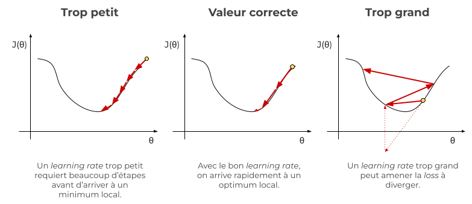

Ce tutoriel a été conçu dans le cadre des journées [Deep Voice de l'IRCAM](https://www.ircam.fr/agenda/deep-voice-paris/detail) par Roman Castagné, Nathan Godey et Benjamin Muller.

Une version du tutoriel en anglais en version pdf slide est disponible [ici](/pdf/hands-on-camembert-tutorial-slides-en.pdf)

Suite à la première partie qui introduis le fonctionnement de CamemBERT en tant que modèle de langue (disponible [ici]()), nous allons désormais étudier comment entrainer et évaluer (*fine-tuner* pour être précis!) CamemBERT pour notre tâche de classification d'acte de dialogue.


# Dans ce Tutoriel:

Ce tutoriel est une introduction au Natural Language Processing et en particulier au modèle de langue de type BERT. 

## Pour cela

Nous allons nous intéresser à une tâche de classification de séquence: **la tâche de prédiction d'acte de dialogue**. 

Nous allons utiliser le dataset MIAM (introduis [ici](https://aclanthology.org/2021.emnlp-main.656.pdf)) afin d'entraîner et d'évaluer nos modèles sur cette tâche. 

Nous travaillerons avec la librairie `transformers` de Hugging-Face 🤗 ainsi que la librairie `pytorch-lightning`.

## Prérequis

- bases en python 
- bases en machine learning


# Partie 2 : *Finetuning* pour la classification de séquences

Dans ce chapitre, nous allons finetuner CamemBERT pour une tâche de classification de séquences.

L'objectif de cette partie est double :
- Apprendre à utiliser des modules Python modernes qui permettent d'entraîner rapidement les modèles de langue (HuggingFace Transformers et Datasets, Pytorch Lightning) ;
- Etudier les performances du modèle de français CamemBERT notamment en comparaison avec un modèle sans pré-entraînement préalable (uniquement entraîné sur la tâche de classification) et un modèle avec un pré-entraînement multilingue.


### Inspection des données pour le modèle

Notre jeu de données étant relativement petit, nous faisons le choix de tokeniser nos données juste avant de les fournir au modèle. La préparation est relativement simple dans notre cas. Nous allons devoir tokeniser les données, les "padder" (i.e. s'assurer que toutes les séquences ont la même longueur) et rajouter des tokens spéciaux. 

Toutes ces opérations ont déjà été faites dans la première partie du notebook, nous réutilisons donc le dataset et la *collate function* `tokenize_batch` afin d'instancier un `DataLoader` qui va fournir les données au modèle en *batch*.

Un batch est un groupe d'exemples donnés au modèle à une étape d'entraînement. La *loss* et les gradients sont calculés et moyennés pour l'ensemble du batch. Cela permet:
- d'éviter une trop grande variance des gradients utilisés pour la descente de gradients stochastique: en moyennant les gradients, la direction de descente estimée à chaque pas est plus proche de la direction de descente théorique;
- de profiter de la parallélisation des calculs offerte par les GPUs pour certaines opérations. On peut ainsi observer une inférence plus rapide avec de plus grands batchs pour un même nombre d'exemples total.


```python
num_labels = dataset["train"].features["Label"].num_classes
```

Re-regardons quelques exemples de phrases issues du jeu de données MIAM. On retrouve à gauche les labels que nous allons devoir prédire.


```python
pd_dataset["validation"][["Dialogue_Act", "Utterance"]].head(40)
```


  <div id="df-07cd8a6c-547c-4135-b820-7564ec16305b">
    <div class="colab-df-container">
      <div>
<style scoped>
    .dataframe tbody tr th:only-of-type {
        vertical-align: middle;
    }

    .dataframe tbody tr th {
        vertical-align: top;
    }

    .dataframe thead th {
        text-align: right;
    }
</style>
<table border="1" class="dataframe">
  <thead>
    <tr style="text-align: right;">
      <th></th>
      <th>Dialogue_Act</th>
      <th>Utterance</th>
    </tr>
  </thead>
  <tbody>
    <tr>
      <th>0</th>
      <td>greet</td>
      <td>Bravo! Vous avez été rapides!</td>
    </tr>
    <tr>
      <th>1</th>
      <td>ask</td>
      <td>Qu'est-ce que je peux faire pour vous?</td>
    </tr>
    <tr>
      <th>2</th>
      <td>next_step</td>
      <td>merci</td>
    </tr>
    <tr>
      <th>3</th>
      <td>inform</td>
      <td>Eh bien, il va falloir la fabriquer cette mane...</td>
    </tr>
    <tr>
      <th>4</th>
      <td>ask</td>
      <td>Mais sinon, vous avez encore des questions sur...</td>
    </tr>
    <tr>
      <th>5</th>
      <td>staff_enterprise</td>
      <td>j'ai un peu de temps... allez y dites moi en p...</td>
    </tr>
    <tr>
      <th>6</th>
      <td>inform</td>
      <td>la plasturgie, c' est plus une question de log...</td>
    </tr>
    <tr>
      <th>7</th>
      <td>ask</td>
      <td>et vous vouliez savoir quelles études ils avai...</td>
    </tr>
    <tr>
      <th>8</th>
      <td>yes</td>
      <td>oui oui</td>
    </tr>
    <tr>
      <th>9</th>
      <td>inform</td>
      <td>Il y a des métiers pour tout le monde du BEP à...</td>
    </tr>
    <tr>
      <th>10</th>
      <td>quit</td>
      <td>Bon, je dois vous laisser. Bon courage pour la...</td>
    </tr>
    <tr>
      <th>11</th>
      <td>greet</td>
      <td>Bravo! Vous avez été rapides!</td>
    </tr>
    <tr>
      <th>12</th>
      <td>ask</td>
      <td>Qu'est-ce que je peux faire pour vous?</td>
    </tr>
    <tr>
      <th>13</th>
      <td>next_step</td>
      <td>est ce que je peux utiliser la manette mainten...</td>
    </tr>
    <tr>
      <th>14</th>
      <td>inform</td>
      <td>Il ne vous reste plus qu' à trouver les compos...</td>
    </tr>
    <tr>
      <th>15</th>
      <td>ask</td>
      <td>Mais avant de partir, voulez vous faire un min...</td>
    </tr>
    <tr>
      <th>16</th>
      <td>yes</td>
      <td>oui</td>
    </tr>
    <tr>
      <th>17</th>
      <td>ask</td>
      <td>Que faudra-t-il faire de votre manette une foi...</td>
    </tr>
    <tr>
      <th>18</th>
      <td>todo_irreparable</td>
      <td>la recycler ?</td>
    </tr>
    <tr>
      <th>19</th>
      <td>inform</td>
      <td>tout à fait, on ramène les équipements hors-se...</td>
    </tr>
    <tr>
      <th>20</th>
      <td>quit</td>
      <td>J'aurais aimé continuer à répondre à vos quest...</td>
    </tr>
    <tr>
      <th>21</th>
      <td>greet</td>
      <td>Bonjour !</td>
    </tr>
    <tr>
      <th>22</th>
      <td>ask</td>
      <td>Il faut que tu trouves l' adresse de l' entrep...</td>
    </tr>
    <tr>
      <th>23</th>
      <td>help</td>
      <td>Ok, où se trouve cette entreprise?</td>
    </tr>
    <tr>
      <th>24</th>
      <td>inform</td>
      <td>Je ne sais pas . . . mon oncle a dit que c' êt...</td>
    </tr>
    <tr>
      <th>25</th>
      <td>quit</td>
      <td>Ok, c'est super!</td>
    </tr>
    <tr>
      <th>26</th>
      <td>greet</td>
      <td>Bonjour, je suis Preparateur1 le préparateur m...</td>
    </tr>
    <tr>
      <th>27</th>
      <td>ask</td>
      <td>Qu'est-ce que je peux faire pour vous?</td>
    </tr>
    <tr>
      <th>28</th>
      <td>inform_material_space</td>
      <td>cet endroit m'intéresse, que pouvez vous me di...</td>
    </tr>
    <tr>
      <th>29</th>
      <td>inform</td>
      <td>Eh bien quand on reçoit les granulés de matièr...</td>
    </tr>
    <tr>
      <th>30</th>
      <td>ask</td>
      <td>vous voulez savoir ce que je fais moi, plus pa...</td>
    </tr>
    <tr>
      <th>31</th>
      <td>yes</td>
      <td>oui, ça m'intéresser !</td>
    </tr>
    <tr>
      <th>32</th>
      <td>inform</td>
      <td>mon rôle, c' est de m' assurer que les machine...</td>
    </tr>
    <tr>
      <th>33</th>
      <td>ask</td>
      <td>Voulez vous en savoir plus?</td>
    </tr>
    <tr>
      <th>34</th>
      <td>no</td>
      <td>non, merci, nous devons filer. Mais ce fut pas...</td>
    </tr>
    <tr>
      <th>35</th>
      <td>ask</td>
      <td>attendez, ne partez pas si vite, j'ai un petit...</td>
    </tr>
    <tr>
      <th>36</th>
      <td>yes</td>
      <td>pas de soucis, je vais vous aider</td>
    </tr>
    <tr>
      <th>37</th>
      <td>inform</td>
      <td>ok, c' est parti</td>
    </tr>
    <tr>
      <th>38</th>
      <td>quit</td>
      <td>Merci de votre aide, bonne journée à vous !</td>
    </tr>
    <tr>
      <th>39</th>
      <td>greet</td>
      <td>Déjà de retour avec les plans ?! Bravo les jeu...</td>
    </tr>
  </tbody>
</table>
</div>
      <button class="colab-df-convert" onclick="convertToInteractive('df-07cd8a6c-547c-4135-b820-7564ec16305b')"
              title="Convert this dataframe to an interactive table."
              style="display:none;">

  <svg xmlns="http://www.w3.org/2000/svg" height="24px"viewBox="0 0 24 24"
       width="24px">
    <path d="M0 0h24v24H0V0z" fill="none"/>
    <path d="M18.56 5.44l.94 2.06.94-2.06 2.06-.94-2.06-.94-.94-2.06-.94 2.06-2.06.94zm-11 1L8.5 8.5l.94-2.06 2.06-.94-2.06-.94L8.5 2.5l-.94 2.06-2.06.94zm10 10l.94 2.06.94-2.06 2.06-.94-2.06-.94-.94-2.06-.94 2.06-2.06.94z"/><path d="M17.41 7.96l-1.37-1.37c-.4-.4-.92-.59-1.43-.59-.52 0-1.04.2-1.43.59L10.3 9.45l-7.72 7.72c-.78.78-.78 2.05 0 2.83L4 21.41c.39.39.9.59 1.41.59.51 0 1.02-.2 1.41-.59l7.78-7.78 2.81-2.81c.8-.78.8-2.07 0-2.86zM5.41 20L4 18.59l7.72-7.72 1.47 1.35L5.41 20z"/>
  </svg>
      </button>

  <style>
    .colab-df-container {
      display:flex;
      flex-wrap:wrap;
      gap: 12px;
    }

    .colab-df-convert {
      background-color: #E8F0FE;
      border: none;
      border-radius: 50%;
      cursor: pointer;
      display: none;
      fill: #1967D2;
      height: 32px;
      padding: 0 0 0 0;
      width: 32px;
    }

    .colab-df-convert:hover {
      background-color: #E2EBFA;
      box-shadow: 0px 1px 2px rgba(60, 64, 67, 0.3), 0px 1px 3px 1px rgba(60, 64, 67, 0.15);
      fill: #174EA6;
    }

    [theme=dark] .colab-df-convert {
      background-color: #3B4455;
      fill: #D2E3FC;
    }

    [theme=dark] .colab-df-convert:hover {
      background-color: #434B5C;
      box-shadow: 0px 1px 3px 1px rgba(0, 0, 0, 0.15);
      filter: drop-shadow(0px 1px 2px rgba(0, 0, 0, 0.3));
      fill: #FFFFFF;
    }
  </style>

      <script>
        const buttonEl =
          document.querySelector('#df-07cd8a6c-547c-4135-b820-7564ec16305b button.colab-df-convert');
        buttonEl.style.display =
          google.colab.kernel.accessAllowed ? 'block' : 'none';

        async function convertToInteractive(key) {
          const element = document.querySelector('#df-07cd8a6c-547c-4135-b820-7564ec16305b');
          const dataTable =
            await google.colab.kernel.invokeFunction('convertToInteractive',
                                                     [key], {});
          if (!dataTable) return;

          const docLinkHtml = 'Like what you see? Visit the ' +
            '<a target="_blank" href=https://colab.research.google.com/notebooks/data_table.ipynb>data table notebook</a>'
            + ' to learn more about interactive tables.';
          element.innerHTML = '';
          dataTable['output_type'] = 'display_data';
          await google.colab.output.renderOutput(dataTable, element);
          const docLink = document.createElement('div');
          docLink.innerHTML = docLinkHtml;
          element.appendChild(docLink);
        }
      </script>
    </div>
  </div>


Il est important, surtout avec de petits jeux de données, que le modèle ne voit pas les données dans le même ordre. Pour éviter cela, on utilise l'argument `shuffle` du DataLoader.


```python
train_dataloader = DataLoader(
    dataset["train"], 
    batch_size=16, 
    shuffle=True, 
    collate_fn=functools.partial(tokenize_batch, tokenizer=tokenizer)
)
val_dataloader = DataLoader(
    dataset["validation"], 
    batch_size=16, 
    shuffle=False, 
    collate_fn=functools.partial(tokenize_batch, tokenizer=tokenizer)
)
```

Une bonne manière de s'assurer que les données sur lesquelles le modèle va s'entraîner sont dans un format correct est de regarder un batch et décoder les indices issus du tokenizer. On retrouve ce à quoi l'on s'attendait : les tokens spéciaux et le padding pour compenser les phrases trop courtes.

On remarque notamment que dans CamemBERT, les séquences utilisent un délimiteur de début de phrase `<s>` et de fin de phrase `</s>`:

```<s>Le chat est sur le matelas.</s>```

Pour les séquences trop courtes par rapport à d'autres séquences du batch, le tokenizer rajoute un token `<pad>` qui ne sera pas considéré par le modèle.


```python
batch = next(iter(train_dataloader))
```


```python
print("\n".join(tokenizer.batch_decode(batch["input_ids"])))
batch["labels"]
```

    <s> Hé bien, c' est du bon travail tout ça</s><pad><pad><pad><pad><pad><pad><pad><pad><pad><pad><pad><pad><pad><pad><pad><pad><pad><pad><pad><pad><pad><pad><pad><pad><pad><pad><pad><pad><pad><pad><pad><pad><pad><pad><pad><pad><pad><pad>
    <s> Ok</s><pad><pad><pad><pad><pad><pad><pad><pad><pad><pad><pad><pad><pad><pad><pad><pad><pad><pad><pad><pad><pad><pad><pad><pad><pad><pad><pad><pad><pad><pad><pad><pad><pad><pad><pad><pad><pad><pad><pad><pad><pad><pad><pad><pad><pad><pad><pad><pad><pad>
    <s> Qu'est-ce que je peux faire pour vous?</s><pad><pad><pad><pad><pad><pad><pad><pad><pad><pad><pad><pad><pad><pad><pad><pad><pad><pad><pad><pad><pad><pad><pad><pad><pad><pad><pad><pad><pad><pad><pad><pad><pad><pad><pad><pad><pad><pad>
    <s> C'est excellent!</s><pad><pad><pad><pad><pad><pad><pad><pad><pad><pad><pad><pad><pad><pad><pad><pad><pad><pad><pad><pad><pad><pad><pad><pad><pad><pad><pad><pad><pad><pad><pad><pad><pad><pad><pad><pad><pad><pad><pad><pad><pad><pad><pad><pad><pad>
    <s> J'en voudrais bien</s><pad><pad><pad><pad><pad><pad><pad><pad><pad><pad><pad><pad><pad><pad><pad><pad><pad><pad><pad><pad><pad><pad><pad><pad><pad><pad><pad><pad><pad><pad><pad><pad><pad><pad><pad><pad><pad><pad><pad><pad><pad><pad><pad><pad><pad>
    <s> Je peux vous aider?</s><pad><pad><pad><pad><pad><pad><pad><pad><pad><pad><pad><pad><pad><pad><pad><pad><pad><pad><pad><pad><pad><pad><pad><pad><pad><pad><pad><pad><pad><pad><pad><pad><pad><pad><pad><pad><pad><pad><pad><pad><pad><pad><pad><pad><pad>
    <s> Mais avant, voulez vous que je vous parle un peu de mon métier, des études que j' ai faites, de mes collègues, ou encore des normes de sécurité applicables ici?</s><pad><pad><pad><pad><pad><pad><pad><pad><pad><pad>
    <s> non merci, nous allons y aller</s><pad><pad><pad><pad><pad><pad><pad><pad><pad><pad><pad><pad><pad><pad><pad><pad><pad><pad><pad><pad><pad><pad><pad><pad><pad><pad><pad><pad><pad><pad><pad><pad><pad><pad><pad><pad><pad><pad><pad><pad><pad><pad><pad>
    <s> d' abord, cherchez la machine qui convient sur laquelle monter votre moule. Avec la fiche du moule et celle des machines, ça ne devrait pas être trop compliqué.</s><pad><pad><pad><pad><pad><pad><pad><pad><pad><pad><pad><pad><pad><pad><pad><pad><pad>
    <s> Bravo! Vous avez été rapides!</s><pad><pad><pad><pad><pad><pad><pad><pad><pad><pad><pad><pad><pad><pad><pad><pad><pad><pad><pad><pad><pad><pad><pad><pad><pad><pad><pad><pad><pad><pad><pad><pad><pad><pad><pad><pad><pad><pad><pad><pad><pad><pad><pad>
    <s> C'est moi qui m'en occupe ici. C' est un métier pour lequel il faut être polyvalent et minutieux.</s><pad><pad><pad><pad><pad><pad><pad><pad><pad><pad><pad><pad><pad><pad><pad><pad><pad><pad><pad><pad><pad><pad><pad><pad><pad>
    <s> Je ne sais pas... mon oncle a dit que c' était quelque part dans ce labo. Il faut fouiller. Regarde voir près du tableau noir là bas.</s><pad><pad><pad><pad><pad><pad><pad><pad><pad><pad><pad><pad><pad><pad><pad><pad><pad>
    <s> Ah, chouette, le design cela m'intéresse!</s><pad><pad><pad><pad><pad><pad><pad><pad><pad><pad><pad><pad><pad><pad><pad><pad><pad><pad><pad><pad><pad><pad><pad><pad><pad><pad><pad><pad><pad><pad><pad><pad><pad><pad><pad><pad><pad><pad><pad>
    <s> doucement man!</s><pad><pad><pad><pad><pad><pad><pad><pad><pad><pad><pad><pad><pad><pad><pad><pad><pad><pad><pad><pad><pad><pad><pad><pad><pad><pad><pad><pad><pad><pad><pad><pad><pad><pad><pad><pad><pad><pad><pad><pad><pad><pad><pad><pad><pad><pad><pad>
    <s> Alors, que voulez vous, dites moi?</s><pad><pad><pad><pad><pad><pad><pad><pad><pad><pad><pad><pad><pad><pad><pad><pad><pad><pad><pad><pad><pad><pad><pad><pad><pad><pad><pad><pad><pad><pad><pad><pad><pad><pad><pad><pad><pad><pad><pad>
    <s> Si vous avez besoins de trouver des plans, je peux vous aider. Mais je peux également vous renseigner sur mon métier, les études qu'il faut faire, le type de personne pour qui c'est approprié, ou encore les normes de sécurité...</s>


    tensor([ 5,  0,  1,  0, 30,  1,  1, 18,  7,  5,  7,  7,  0, 19,  1,  7])


## Préparer le modèle

Nous utilisons PyTorch Lightning, un utilitaire autour de PyTorch qui facilite l'entraînement de modèles de Machine Learning notamment en supprimant les boucles d'entraînement et d'optimisation écrites à la main.

Pour utiliser PL, nous allons "wrapper" notre modèle dans un `LightningModule` et implémenter trois méthodes essentielles :
- `training_step` prend en entrée les données d'un batch qui sont passées au modèle et retourne la loss du modèle sur ce batch. C'est ici qu'on définit la fonction de *CrossEntropy*.
- `validation_step` est similaire à `training_step` mais retourne les métriques de validation utilisées (dans notre cas, l'exactitude ou *accuracy*).
- `configure_optimizers` retourne l'optimiseur que nous souhaitons utiliser pour l'entraînement. L'un des optimiseurs les plus utilisés avec les modèles Transformers est AdamW, disponible directement dans `torch.optim`. On précise le taux d'apprentissage ou *learning rate* lors de la définition de l'optimiseur.

Le *learning rate* permet d'ajuster la longueur du pas effectué à chaque étape d'optimisation. Un pas trop long peut empêcher la convergence, mais un pas trop court peut allonger le temps d'entraînement, comme le montre ce schéma:
<!-- <p align="center">
  
</p> -->




Pour rappel, la fonction cross-entropy est une mesure de divergence entre les prédictions du modèle et les labels observés. La cross-entropy est définie par :

<!-- $$\text{CE}(y, \hat{y}) = \sum_i y_i \log(\hat{y}_i)$$ -->

$$ \text{softmax}(s) = \left( \frac{e^{s_i}}{\sum_k e^{s_k}} \right)_{i\in[|1,K|]} \text{for } s\in \mathbb{R}^K.$$

Texte et tout

<!-- <p align="center">
  
</p> -->


```python
class LightningModel(pl.LightningModule):
    def __init__(self, model_name, num_labels, lr, weight_decay, from_scratch=False):
        super().__init__()
        self.save_hyperparameters()
        if from_scratch:
            # Si `from_scratch` est vrai, on charge uniquement la config (nombre de couches, hidden size, etc.) et pas les poids du modèle 
            config = AutoConfig.from_pretrained(
                model_name, num_labels=num_labels
            )
            self.model = AutoModelForSequenceClassification.from_config(config)
        else:
            # Cette méthode permet de télécharger le bon modèle pré-entraîné directement depuis le Hub de HuggingFace sur lequel sont stockés de nombreux modèles
            self.model = AutoModelForSequenceClassification.from_pretrained(
                model_name, num_labels=num_labels
            )
        self.lr = lr
        self.weight_decay = weight_decay
        self.num_labels = self.model.num_labels

    def forward(self, batch):
        return self.model(
            input_ids=batch["input_ids"],
            attention_mask=batch["attention_mask"]
        )

    def training_step(self, batch):
        out = self.forward(batch)

        logits = out.logits
        # -------- MASKED --------
        loss_fn = torch.nn.CrossEntropyLoss()
        loss = loss_fn(logits.view(-1, self.num_labels), batch["labels"].view(-1))

        # ------ END MASKED ------

        self.log("train/loss", loss)

        return loss

    def validation_step(self, batch, batch_index):
        labels = batch["labels"]
        out = self.forward(batch)

        preds = torch.max(out.logits, -1).indices
        # -------- MASKED --------
        acc = (batch["labels"] == preds).float().mean()
        # ------ END MASKED ------
        self.log("valid/acc", acc)

        f1 = f1_score(batch["labels"].cpu().tolist(), preds.cpu().tolist(), average="macro")
        self.log("valid/f1", f1)

    def predict_step(self, batch, batch_idx):
        """La fonction predict step facilite la prédiction de données. Elle est 
        similaire à `validation_step`, sans le calcul des métriques.
        """
        out = self.forward(batch)

        return torch.max(out.logits, -1).indices

    def configure_optimizers(self):
        return torch.optim.AdamW(
            self.model.parameters(), lr=self.lr, weight_decay=self.weight_decay
        )
```


```python
lightning_model = LightningModel("camembert-base", num_labels, lr=3e-5, weight_decay=0.)
```

    Some weights of the model checkpoint at camembert-base were not used when initializing CamembertForSequenceClassification: ['roberta.pooler.dense.weight', 'lm_head.dense.bias', 'lm_head.dense.weight', 'lm_head.layer_norm.bias', 'lm_head.decoder.weight', 'lm_head.bias', 'lm_head.layer_norm.weight', 'roberta.pooler.dense.bias']
    - This IS expected if you are initializing CamembertForSequenceClassification from the checkpoint of a model trained on another task or with another architecture (e.g. initializing a BertForSequenceClassification model from a BertForPreTraining model).
    - This IS NOT expected if you are initializing CamembertForSequenceClassification from the checkpoint of a model that you expect to be exactly identical (initializing a BertForSequenceClassification model from a BertForSequenceClassification model).
    Some weights of CamembertForSequenceClassification were not initialized from the model checkpoint at camembert-base and are newly initialized: ['classifier.dense.bias', 'classifier.dense.weight', 'classifier.out_proj.weight', 'classifier.out_proj.bias']
    You should probably TRAIN this model on a down-stream task to be able to use it for predictions and inference.


<!-- ### Suivre l'entraînement

Pour suivre l'avancement de l'entraînement du modèle, il est d'usage d'utiliser un "logger" (par exemple, TensorBoard ou Weights and Biases) qui permet d'afficher les graphes utiles : valeur de la loss, *accuracy* du modèle sur les données de validation, performances du GPU etc.  -->


## Lancer l'entraînement

Avec PyTorch Lightning, pas besoin de boucle d'entraînement écrite à la main comme avec PyTorch, le Trainer se charge de sélectionner les GPUs, s'arrêter au bon nombre d'epochs, et de nombreuses autres options. Si vous avez besoin d'une fonctionnalité spéciale, il y a de grandes chances que celle-ci soit déjà implémentée dans Pytorch Lightning.

Cependant, l'entraînement de modèles de Deep Learning demande de connaître quelques termes techniques, nous allons décrire ceux que vous pourrez croiser dans ce notebook ici :
- **epochs**: une passe sur toutes les données d'entraînement. Si l'on fait 15 epochs, le modèle aura "vu" 15 fois les données.
- **early stopping**: technique qui consiste à arrêter l'entraînement du modèle lorsqu'une métrique (généralement la loss ou l'accuracy sur les données de validation) arrête de diminuer ou augmenter. Cela permet d'éviter l'overfitting, c'est à dire une mémorisation des données d'entraînement au détriment de la généralisation du modèle sur de nouvelles données. La **patience** spécifie combien d'epochs attendre avant de stopper l'entraînement si la métrique n'a toujours pas été améliorée.
- **model checkpoints**: des sauvegardes du modèle au fur et à mesure de l'entraînement. Ici, on demande à PytorchLightning de sauver le meilleur modèle par rapport à l'exactitude sur les données de validation.


```python
model_checkpoint = pl.callbacks.ModelCheckpoint(monitor="valid/acc", mode="max")

camembert_trainer = pl.Trainer(
    max_epochs=20,
    gpus=1,
    callbacks=[
        pl.callbacks.EarlyStopping(monitor="valid/acc", patience=4, mode="max"),
        model_checkpoint,
    ]
)
```

    GPU available: True, used: True
    TPU available: False, using: 0 TPU cores
    IPU available: False, using: 0 IPUs
    HPU available: False, using: 0 HPUs


```python
camembert_trainer.fit(lightning_model, train_dataloaders=train_dataloader, val_dataloaders=val_dataloader)
```

    Missing logger folder: /content/lightning_logs
    LOCAL_RANK: 0 - CUDA_VISIBLE_DEVICES: [0]
    
      | Name  | Type                               | Params
    -------------------------------------------------------------
    0 | model | CamembertForSequenceClassification | 110 M 
    -------------------------------------------------------------
    110 M     Trainable params
    0         Non-trainable params
    110 M     Total params
    442.583   Total estimated model params size (MB)


    Sanity Checking: 0it [00:00, ?it/s]

    /usr/local/lib/python3.7/dist-packages/pytorch_lightning/utilities/data.py:73: UserWarning:
    
    Trying to infer the `batch_size` from an ambiguous collection. The batch size we found is 16. To avoid any miscalculations, use `self.log(..., batch_size=batch_size)`.
    
    Training: 0it [00:00, ?it/s]


Récupérons le meilleur modèle sauvé par le *callback* `ModelCheckpoint`. Autrement, le modèle a toujours les derniers poids issus de l'optimisation, qui ne donnent pas forcément la meilleure valeur de la métrique.


```python
lightning_model = LightningModel.load_from_checkpoint(checkpoint_path=model_checkpoint.best_model_path)
```

    Some weights of the model checkpoint at camembert-base were not used when initializing CamembertForSequenceClassification: ['roberta.pooler.dense.weight', 'lm_head.dense.bias', 'lm_head.dense.weight', 'lm_head.layer_norm.bias', 'lm_head.decoder.weight', 'lm_head.bias', 'lm_head.layer_norm.weight', 'roberta.pooler.dense.bias']
    - This IS expected if you are initializing CamembertForSequenceClassification from the checkpoint of a model trained on another task or with another architecture (e.g. initializing a BertForSequenceClassification model from a BertForPreTraining model).
    - This IS NOT expected if you are initializing CamembertForSequenceClassification from the checkpoint of a model that you expect to be exactly identical (initializing a BertForSequenceClassification model from a BertForSequenceClassification model).
    Some weights of CamembertForSequenceClassification were not initialized from the model checkpoint at camembert-base and are newly initialized: ['classifier.dense.bias', 'classifier.dense.weight', 'classifier.out_proj.weight', 'classifier.out_proj.bias']
    You should probably TRAIN this model on a down-stream task to be able to use it for predictions and inference.


### Notebook checkpoint

Si jamais vous n'avez pas pu entraîner le modèle ci dessus, vous pouvez en télécharger une version similaire sauvegardée sur le Hub d'HuggingFace :


```python
lightning_model = LightningModel("RomanCast/camembert-miam-loria-finetuned", num_labels, lr=3e-5, weight_decay=0.)
```


## Inférence avec le modèle entraîné


```python
ID_TO_LABEL = dataset["train"].features["Label"].names
```


```python
def get_preds(model, tokenizer, sentence):
    tokenized_sentence = tokenizer(sentence, return_tensors="pt")
    input_ids, attention_mask = tokenized_sentence.input_ids, tokenized_sentence.attention_mask

    out = model(
        input_ids=tokenized_sentence.input_ids,
        attention_mask=tokenized_sentence.attention_mask
    )

    logits = out.logits

    probas = torch.softmax(logits, -1).squeeze()

    pred = torch.argmax(probas)

    return ID_TO_LABEL[pred], probas[pred].item()
```

La fonction `get_preds` permet d'évaluer simplement les sorties de notre modèle. Remplacez seulement la phrase dans `test_sentence` pour observer les sorties du modèle.


```python
test_sentence = "Bonjour, vous allez bien ?"

label_predicted, proba = get_preds(lightning_model.model, tokenizer, test_sentence)

print(f"Label: {label_predicted}, confidence: {proba:.2f}")
```

    Label: greet, confidence: 1.00


## Modèle pré-entraîné vs. modèle initialisé aléatoirement

Un moyen facile d'apprécier les gains du pré-entraînement consiste à entraîner un modèle dont les poids aurait été initialisés aléatoirement. Alors qu'un modèle pré-entraîné a appris à prédire des gaps dans des millions de phrases, un modèle initialisé aléatoirement ne verra que les données de la tâche de *finetuning* qu'on lui donne.

Nous proposons donc ici d'utiliser un modèle n'ayant reçu aucun pré-entraînement et de l'entraîner uniquement sur le dataset MIAM afin de quantifier exactement l'impact du pré-entraînement.


```python
no_init_lightning_model = LightningModel("camembert-base", num_labels, lr=3e-5, weight_decay=0., from_scratch=True)
```


```python
model_checkpoint = pl.callbacks.ModelCheckpoint(monitor="valid/acc", mode="max")

no_init_trainer = pl.Trainer(
    max_epochs=30,
    gpus=1,
    callbacks=[
        pl.callbacks.EarlyStopping(monitor="valid/acc", patience=4, mode="max"),
        model_checkpoint,
    ]
)
```

    GPU available: True, used: True
    TPU available: False, using: 0 TPU cores
    IPU available: False, using: 0 IPUs
    HPU available: False, using: 0 HPUs


```python
no_init_trainer.fit(no_init_lightning_model, train_dataloaders=train_dataloader, val_dataloaders=val_dataloader)
```

    LOCAL_RANK: 0 - CUDA_VISIBLE_DEVICES: [0]
    
      | Name  | Type                               | Params
    -------------------------------------------------------------
    0 | model | CamembertForSequenceClassification | 110 M 
    -------------------------------------------------------------
    110 M     Trainable params
    0         Non-trainable params
    110 M     Total params
    442.583   Total estimated model params size (MB)


    Sanity Checking: 0it [00:00, ?it/s]

    Training: 0it [00:00, ?it/s]


```python
no_init_lightning_model = LightningModel.load_from_checkpoint(checkpoint_path=model_checkpoint.best_model_path)
```

Nous trouvons une accuracy de 83,65, quasiment 4 points de moins qu'avec le modèle pré-entraîné !

Comme précédemment, si vous n'avez pas pu entraîné le modèle non-initialisé, téléchargez le ici en décommentant cette cellule :


```python
lightning_model = LightningModel("RomanCast/no_init_miam_loria_finetuned", num_labels, lr=3e-5, weight_decay=0.)
```


### Matrice de confusion 

Nous allons regarder ici les matrices de confusion des deux modèles, c'est à dire comparer les prédictions des modèles aux labels originaux. Pour cela, nous faisons une prédiction complète sur les données de validation à l'aide du *trainer*.


```python
camembert_preds = camembert_trainer.predict(lightning_model, dataloaders=val_dataloader)
camembert_preds = torch.cat(camembert_preds, -1)
```

    LOCAL_RANK: 0 - CUDA_VISIBLE_DEVICES: [0]

    Predicting: 0it [00:00, ?it/s]


```python
no_init_preds = camembert_trainer.predict(no_init_lightning_model, dataloaders=val_dataloader)
no_init_preds = torch.cat(no_init_preds, -1)
```

    LOCAL_RANK: 0 - CUDA_VISIBLE_DEVICES: [0]

    Predicting: 0it [00:00, ?it/s]


```python
label_names = dataset["validation"].features["Label"].names
labels = dataset["validation"]["Label"]
```


```python
def plot_confusion_matrix(labels, preds, label_names):
    confusion_norm = confusion_matrix(labels, preds.tolist(), labels=list(range(len(label_names))), normalize="true")
    confusion = confusion_matrix(labels, preds.tolist(), labels=list(range(len(label_names))))
    
    plt.figure(figsize=(16, 14))
    sns.heatmap(
        confusion_norm,
        annot=confusion,
        cbar=False,
        fmt="d",
        xticklabels=label_names,
        yticklabels=label_names,
        cmap="viridis"
    )
```

Sur le graphe suivant, chaque ligne correspond au vrai label, chaque colonne au label prédit. Par exemple, le modèle camembert a bien prédit le label "ack" dans la plupart des cas, mais le confond régulièrement avec le label "yes". En revanche, le label "kindatt" est tout le temps confondu avec "ack".


```python
plot_confusion_matrix(labels, camembert_preds, label_names)
```


    

    


```python
plot_confusion_matrix(labels, no_init_preds, label_names)
```


    

    


<!-- ## Bonus : Comparaison avec un modèle multilingue : XLM-RoBERTa


```python
multilingual_tokenizer = AutoTokenizer.from_pretrained("xlm-roberta-base")
```

    Some weights of the model checkpoint at xlm-roberta-base were not used when initializing XLMRobertaForSequenceClassification: ['lm_head.bias', 'roberta.pooler.dense.bias', 'lm_head.dense.bias', 'lm_head.layer_norm.bias', 'lm_head.decoder.weight', 'lm_head.dense.weight', 'roberta.pooler.dense.weight', 'lm_head.layer_norm.weight']
    - This IS expected if you are initializing XLMRobertaForSequenceClassification from the checkpoint of a model trained on another task or with another architecture (e.g. initializing a BertForSequenceClassification model from a BertForPreTraining model).
    - This IS NOT expected if you are initializing XLMRobertaForSequenceClassification from the checkpoint of a model that you expect to be exactly identical (initializing a BertForSequenceClassification model from a BertForSequenceClassification model).
    Some weights of XLMRobertaForSequenceClassification were not initialized from the model checkpoint at xlm-roberta-base and are newly initialized: ['classifier.out_proj.bias', 'classifier.out_proj.weight', 'classifier.dense.weight', 'classifier.dense.bias']
    You should probably TRAIN this model on a down-stream task to be able to use it for predictions and inference.


```python
multilingual_lightning_model = LightningModel(
    "xlm-roberta-base", num_labels, lr=3e-5, weight_decay=0.
)

multiling_trainer = pl.Trainer(
    max_epochs=20,
    gpus=1,
    callbacks=[
        pl.callbacks.EarlyStopping(monitor="valid/acc", patience=4, mode="max"),
        pl.callbacks.ModelCheckpoint(monitor="valid/acc", mode="max")
    ]
)
```

    GPU available: True, used: True
    TPU available: False, using: 0 TPU cores
    IPU available: False, using: 0 IPUs
    HPU available: False, using: 0 HPUs


On remarque que le nombre de paramètres de XLM-RoBERTa est beaucoup plus important.

En effet, puisque XLM-RoBERTa supporte plus d'une centaine de langues, son vocabulaire d'entrée est bien plus large. Or, chaque élément du vocabulaire ayant un *embedding* correspondant.

Ainsi, le nombre de paramètres contenus dans la couche d'embedding de CamemBERT est, en appelant $V$ la taille du vocabulaire et $H$ la *hidden size* du modèle :

$$V\ \times H = 32000 \times 768=25M$$

Dans XLM-RoBERTa on a :

$$V\ \times H = 250000 \times 768=192M$$

soit $167M$ de paramètres en plus !


```python
multi_train_dataloader = DataLoader(
    dataset["train"], 
    batch_size=16, 
    shuffle=True, 
    collate_fn=functools.partial(tokenize_batch, tokenizer=multilingual_tokenizer)
)
multi_val_dataloader = DataLoader(
    dataset["validation"], 
    batch_size=16, 
    shuffle=False, 
    collate_fn=functools.partial(tokenize_batch, tokenizer=multilingual_tokenizer)
)
```


```python
multiling_trainer.fit(
    multilingual_lightning_model,
    train_dataloaders=multi_train_dataloader,
    val_dataloaders=multi_val_dataloader
)
```

    LOCAL_RANK: 0 - CUDA_VISIBLE_DEVICES: [0]
    
      | Name  | Type                                | Params
    --------------------------------------------------------------
    0 | model | XLMRobertaForSequenceClassification | 278 M 
    --------------------------------------------------------------
    278 M     Trainable params
    0         Non-trainable params
    278 M     Total params
    1,112.270 Total estimated model params size (MB)


    Sanity Checking: 0it [00:00, ?it/s]

    Training: 0it [00:00, ?it/s]

 -->
